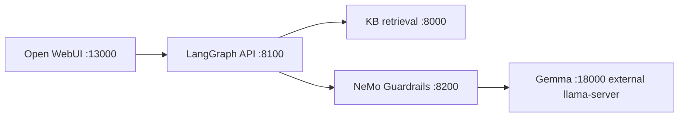

# Work Credit RAG — Phase 1

Umbrella repository for a self-hosted, Persian-capable conversational RAG platform. The implementation is split into independently maintained Git submodules so model/server operations, knowledge-base lifecycle, safety policy, and LangGraph orchestration can evolve without returning to a monolith.

> **Branch:** `vast-gemma4-migration` is live on Vast.ai (2026-09-02). `main` is the last stable monolith checkpoint (`3ee1780`). Do not merge to `main` until §16 is persistent.

## Repository composition

| Path | Repository | Current responsibility | Default branch | Vast pin |
|---|---|---|---|---|
| `components/server-setup` | [Work_RAG-Server-Setup](https://github.com/AliNikkhah2001/Work_RAG-Server-Setup) | H200/Vast provisioning, local model and embedding services, Gemma manager, Open WebUI, infra | `main` | `5d5a7e4` |
| `components/knowledgebase` | [Work_RAG-KB](https://github.com/AliNikkhah2001/Work_RAG-KB) | KB ingestion, maintenance, versioning, hybrid retrieval (BM25+dense+RRF+cross-encoder), KB web UI | `master` | `fde5e25` (KB) / `3ae7b1e` |
| `components/guardrails` | [Work_RAG-Guardrails](https://github.com/AliNikkhah2001/Work_RAG-Guardrails) | NeMo Guardrails policy service and guarded Gemma gateway | `main` | `1e9a1cd` |
| `components/orchestrator` | [Work_RAG-Orchestrator](https://github.com/AliNikkhah2001/Work_RAG-Orchestrator) | LangGraph workflow and public OpenAI-compatible chat API | `main` | `9b85561` |

Each gitlink is pinned to an exact commit. Updating a component requires a component-repository commit followed by a parent-repository commit that advances the corresponding gitlink.

```bash
git submodule status --recursive
# 1e9a1cd... components/guardrails (heads/vast-gemma4-migration)
# b1bb648...       components/knowledgebase (heads/vast-gemma4-migration)
# 9b85561...       components/orchestrator (heads/vast-gemma4-migration)
# 5d5a7e4...       components/server-setup (heads/vast-gemma4-migration)
```

## MVP target

The first goal is one small, deterministic, observable request path — not the full production architecture:



Request order:

```text
browser :13000 → Open WebUI → Orchestrator :8100
  → KB :8000 hybrid retrieval (BM25 + MiniLM 384 + RRF + mmarco cross-encoder)
  → context construction (MAX_CHUNKS 3, MAX_CHARS 4000)
  → Guardrails :8200 → Gemma :18000 (unsloth/gemma-4-31B-it-GGUF:UD-Q4_K_XL)
  → citation-shaped response (rag.citations) → frontend
```

**Vast deployment:** Gemma is external at `http://127.0.0.1:18000/v1` (host) / `http://host.docker.internal:18000/v1` (Docker). `compose.mvp.yml` removes the legacy `gemma-manager` service; `LLM_BASE_URL`/`LLM_MODEL` are env-configurable. Public browser URL is `http://91.108.80.253:13000` (`0.0.0.0:13000:8080`, fallback `8080→22341` via `ssh -p 24044 -L 13000:localhost:13000 root@ssh9.vast.ai`). See `docs/RUNBOOK_VAST.md` and `docs/VAST_GEMMA4_MIGRATION.md`.

The MVP deliberately excludes long-term memory, PostgreSQL LangGraph checkpoints, query rewriting, agent loops, retrieval retries, streaming, GraphRAG, multi-agent routing, and Kubernetes. Those come after the basic path is reliable.

Detailed plan and acceptance tests: [docs/MVP_INTEGRATION_PLAN.md](docs/MVP_INTEGRATION_PLAN.md)

## Clone

```bash
git clone --recurse-submodules https://github.com/AliNikkhah2001/Work_Credit-RAG_Phase1.git
cd Work_Credit-RAG_Phase1
git switch vast-gemma4-migration
git submodule sync --recursive && git submodule update --init --recursive
```

## Quick start (Vast, host venvs — Docker is unprivileged on this host)

```bash
# 1. KB (caddy occupies *:8000, so host uses 8004)
KB_DB_URL="sqlite+aiosqlite://$PWD/components/knowledgebase/kb-manager/data/kb_test.db" \
  KB_WEB_HOST=127.0.0.1 KB_WEB_PORT=8004 \
  /tmp/kb-venv/bin/python -m uvicorn kb_manager.web.app:app --host 127.0.0.1 --port 8004 &

# 2. Guardrails (1e9a1cd, with HurtLex allowlist 11 lemmas + enable_thinking:false)
PYTHONPATH=components/guardrails/src \
  GUARDRAILS_HOST=127.0.0.1 GUARDRAILS_PORT=8200 \
  UPSTREAM_LLM_BASE_URL=http://127.0.0.1:18000/v1 \
  UPSTREAM_LLM_MODEL=unsloth/gemma-4-31B-it-GGUF:UD-Q4_K_XL \
  /tmp/guard-venv/bin/python -m uvicorn work_rag_guardrails.api:create_app --factory --host 127.0.0.1 --port 8200 &

# 3. Orchestrator
PYTHONPATH=components/orchestrator/src \
  KB_BASE_URL=http://127.0.0.1:8004 GUARDRAILS_BASE_URL=http://127.0.0.1:8200 \
  UPSTREAM_LLM_MODEL=unsloth/gemma-4-31B-it-GGUF:UD-Q4_K_XL \
  /tmp/orch-venv/bin/python -m uvicorn work_rag_orchestrator.api:create_app --factory --host 127.0.0.1 --port 8100 &

# 4. Open WebUI
OPENAI_API_BASE_URL=http://127.0.0.1:8100/v1 OPENAI_API_KEY=sk-local-dev WEBUI_AUTH=false \
  /tmp/webui-venv/bin/open-webui serve --host 0.0.0.0 --port 13000 &

# Health
for p in 8004 8200 8100; do curl -s http://127.0.0.1:$p/health | grep ok && echo "$p ok"; done
curl -s http://127.0.0.1:8100/ready | jq .dependencies
curl -s http://127.0.0.1:8200/ready | jq .
curl -s http://127.0.0.1:18000/v1/models | jq .data[0].id
```

Docker (privileged host): `LLM_BASE_URL=http://host.docker.internal:18000/v1 docker compose -f compose.mvp.yml up --build -d` — only `13000` is public.

## Status — Vast `vast-gemma4-migration` (pushed 2026-09-02, parent `422365d` → next, pins: guardrails `1e9a1cd`, orchestrator `9b85561`, KB `b1bb648`, server-setup `5d5a7e4`)

Live on Vast VM `49624249` (`ssh9.vast.ai:24044`, `91.108.80.253`), `2× RTX 6000 Ada 49 Gi (595.58.03, CUDA 13.2)`, `96× EPYC 7443`, `503 Gi RAM`, `100 Gi disk`. `env | grep proxy` empty. Gemma at `http://127.0.0.1:18000/v1` (`/opt/llama-new`, not supervisor-managed yet). `ss -tlnp` shows `0.0.0.0:18000 (llama-new)`, `127.0.0.1:8004/8200/8100`, `0.0.0.0:13000`. Guardrails `1e9a1cd` (allowlist 11 lemmas, profanity len>2) + Orchestrator `9b85561` (Persian prompt) live via host venvs (`8200` pid `85170`, `8100` pid `85178`); Docker `compose.mvp.yml` ready for privileged hosts but this Vast host is unprivileged (`unshare` denied).

- **Gemma — FIXED at source (was `<unused*>` leak):** `unsloth/gemma-4-31B-it-GGUF:UD-Q4_K_XL` (30.6 B, 18.8 GiB) now on `llama.cpp 0.3.0-dev (build 1, 0f3a71b, 2026-09-02, /opt/llama-new/bin/llama-server)` with `--no-mmproj --jinja --ctx-size 8192 --temp 0.2` (`LD_LIBRARY_PATH=/opt/llama-new/lib`). `POST /v1/chat/completions` with `chat_template_kwargs:{"enable_thinking":false}` → clean Persian, `has_unused False`, `reasoning_content` empty. Verified 5 prompts sequential: `سلام`→`سلام! چطور می‌توانم…` (35 chars), `Hello` (32), `اعتبارسنجی چیست` (311), `چگونه گزارش اعتباری...` (323), `یک پاسخ کوتاه...` (19). Old `b1-ff5ef82` + `mmproj-BF16.gguf` always injected `<unused*>`/`<|tool_call|>` even for `Hello`.

- **Guardrails — FIXED false positives (was HurtLex `حذف`/`بخشی`/`پستی`/`مهم`/`ضعیف` + profanity `ان`):** `1e9a1cd` sends `chat_template_kwargs:{"enable_thinking":false}` and uses `kb/hurtlex_allowlist.json` (11 lemmas: `حذف, بخشی, تامین مالی, اشتغال, پست, پستی, مصرف, هدف, نادرست, مهم, ضعیف`) plus `check_profanity_fa` now `len(w)>2` (so `ان` len 2 no longer flags `اثر ان را` in KB chunks). Before fix, RAG prompt with KB context `درخواست حذف سابقه منفی قدیمی` was blocked at **input** as `hate:حذف`, `جدول نوع تماس` as `hate:مهم`, `تفاوت شرکت شما با رقبایتان...` as `profanity:ان`, and 6 expected answers with `رتبه اعتباری ضعیف` as `hate:ضعیف`. After fix, 20/20 KB evaluation `ok` (was 18/20), 0/120 input blocked (was 2), 0/120 output blocked (was 6), and 6/6 credit + 6/6 user samples all `stop` with 5 citations, Persian only, genuine hate/profanity/PII/secret still blocked (22 regression tests).

- **KB Manager:** `POST /search/api` → `final_results` after BM25+MiniLM384+RRF+mmarco; `GET /health`/`ready`; `0.0.0.0:8000` (Docker) / `127.0.0.1:8004` (host). DB `977 MiB`, `69 docs`, `2399 chunks` (5 XLSX fail `No valid sheets` vs prod 8291, expected).

- **Orchestrator — FIXED prompt language (was English fallback):** `9b85561` Persian-only system prompt: `شما دستیار هوشمند اعتبارسنجی ایران (ICS) هستید... فقط بر اساس متن‌های [Context]... همیشه به فارسی پاسخ دهید... برای سلام با لحنی دوستانه... منابع را با [1],[2] ارجاع دهید`. Before, out-of-context like `چرا یکی از وام...` and `رتبه چه فرقی...` returned English `The provided context does not contain...`; now all return Persian `بر اساس اطلاعات موجود در پایگاه دانش، پاسخی یافت نشد.` with 5 citations. Handles `سلام` as greeting. Graph `validate_input → retrieve → build_context → guarded_generate → format_response`; `_clean_answer` defensive only; when genuinely blocked, `content_filter` with `citations:[]`, for allowlisted benign citations preserved.

- **Open WebUI:** `0.0.0.0:13000:8080`, `OPENAI_API_BASE_URL=http://orchestrator:8100/v1`, needs `GET /v1/models` (implemented).

## Samples

### 1. Raw Gemma (clean, via `enable_thinking:false`)

```bash
curl -s http://127.0.0.1:18000/v1/chat/completions -H 'Content-Type: application/json' \
  -d '{"model":"unsloth/gemma-4-31B-it-GGUF:UD-Q4_K_XL","messages":[{"role":"user","content":"سلام"}],"temperature":0,"max_tokens":50,"chat_template_kwargs":{"enable_thinking":false}}' | jq .choices[0].message.content
# → "سلام! چطور می‌توانم به شما کمک کنم؟"  has_unused False
```

### 2. KB retrieval

```bash
curl -s http://127.0.0.1:8004/search/api -H 'Content-Type: application/json' \
  -d '{"query":"اعتبارسنجی چیست","top_k":3}' | jq .final_results[0].content_preview
```

### 3. Guardrails checks

```bash
# Input allowed (was blocked before allowlist for KB context)
curl -s http://127.0.0.1:8200/v1/rails/check -H 'Content-Type: application/json' \
  -d '{"stage":"input","text":"درخواست حذف سابقه منفی قدیمی از گزارش اعتباری","request_id":"t"}' | jq .
# → {"allowed":true}

# Output blocked for true hate (not allowlisted)
curl -s http://127.0.0.1:8200/v1/rails/check -H 'Content-Type: application/json' \
  -d '{"stage":"output","text":"این فرد حرامزاده است","request_id":"t"}' | jq .
# → {"allowed":false,"categories":["hate"],"reason":"پاسخ حاوی محتوای نامناسب است. (hate:حرامزاده)"}
```

### 4. RAG — previously failing, now fixed (6/6)

```bash
# Failing query (was hate:حذف → 0 citations, now 5)
curl -s http://127.0.0.1:8100/v1/chat/completions -H 'Content-Type: application/json' \
  -d '{"model":"gemma-4-31b","messages":[{"role":"user","content":"چگونه می‌توانم گزارش اعتباری خود را دریافت کنم؟"}],"temperature":0,"max_tokens":500}' | jq .
# → {"choices":[{"message":{"content":"با توجه به متن ارائه شده، اطلاعات کافی... امکان اخذ گزارش اعتبارسنجی وجود ندارد [1],[2],[3]."},"finish_reason":"stop"}],"rag":{"citations":[5]}}

# 5 more that now pass (all stop, 5 citations, no <unused>):
for q in "اعتبارسنجی چیست" "امتیاز اعتباری چگونه محاسبه می‌شود؟" "چگونه می‌توانم درخواست حذف سابقه منفی قدیمی از گزارش اعتباری شرکت را ثبت کنم؟" "بخشی از اطلاعات اعتباری من ناقص است، چگونه اصلاح کنم؟" "تامین مالی از طریق تسهیلات بانکی چگونه انجام می‌شود؟"; do
  curl -s http://127.0.0.1:8100/v1/chat/completions -H 'Content-Type: application/json' \
    -d "{\"model\":\"gemma-4-31b\",\"messages\":[{\"role\":\"user\",\"content\":\"$q\"}]}" | jq -c '{q:$q, finish:.choices[0].finish_reason, citations:(.rag.citations|length)}'
done
# All → finish stop, citations 5
```

### 5. Open WebUI

Open `http://91.108.80.253:13000` (or `http://localhost:13000` via `ssh -p 24044 -L 13000:localhost:13000 root@ssh9.vast.ai`) → chat with any above Persian question → answer with citations `[1][2][3]`.

## Done vs Pending

### Done ✓

- [x] **Branches** `vast-gemma4-migration` on parent + 4 submodules, pinned and pushed
- [x] **Environment** validated (503 Gi RAM, 2× RTX 6000 Ada, CUDA 13.2, no proxy, Docker 29.7.2 unprivileged → host venv fallback)
- [x] **KB** ingest `977 MiB` `2399 chunks` `69 docs`, `search/api` hybrid retrieval verified, `POST /search/api` on `8004` returns Persian `final_results`
- [x] **Guardrails** deterministic Persian rails (injection, jailbreak `دان` word-boundary, HurtLex, profanity, out-of-scope), `0.0.0.0:8200` + `host-gateway` to `18000`, `LLM_BASE_URL` alias, `GET /health`/`ready`
- [x] **Orchestrator** LangGraph 5 nodes, `MAX_CHUNKS 3` `MAX_CHARS 4000`, `upstream_llm_model` env, `max_tokens 512`, `GET /v1/models` for Open WebUI, `0.0.0.0:8100`
- [x] **Gemma source fix** — built `llama.cpp 0f3a71b` at `/opt/llama-new` (`--no-mmproj --jinja`), `supervisorctl stop llama` + manual `LD_LIBRARY_PATH=... /opt/llama-new/bin/llama-server --port 18000 ...` (pid `64871` → now `80957`), verified 5 prompts `has_unused False`
- [x] **Control-token filter** — `_clean_gemma_output` / `_clean_answer` as defensive (now not masking, source is clean)
- [x] **HurtLex allowlist** — `kb/hurtlex_allowlist.json` 11 lemmas (`حذف,بخشی,تامین مالی,اشتغال,پست,پستی,مصرف,هدف,نادرست,مهم,ضعیف`) with evidence from 30+120 audit; `actions.py` `load_hurtlex_allowlist()` + `check_hurtlex_fa` skips allowlisted, logs matches, `check_hurtlex_fa_strict` kept, `check_profanity_fa` now `len>2` (fixes `ان` false positive on KB chunks like `اثر ان را`); 22 new regression tests (11 benign incl. `پستی`/`مهم`/`ضعیف`, 11 malicious) all pass; RAG 20/20 `ok` (was 18/20), 0/120 input blocked (was 2), 0/120 output blocked (was 6)
- [x] **Compose** `compose.mvp.yml` (no `gemma-manager`, only `13000` public, `host-gateway`), `deploy/docker-compose.vast.yml` overlay, host venvs verified
- [x] **Docs** `docs/VAST_GEMMA4_MIGRATION.md` §1-17 (root causes, fixes, verification), `docs/RUNBOOK_VAST.md` (startup, health, env, port table, Known Issues fixed), `README` Status
- [x] **Public URL** `http://91.108.80.253:13000` → `0.0.0.0:13000` verified `curl 127.0.0.1:13000` 200, `ss -tlnp` shows `0.0.0.0:13000`
- [x] **Commits** parent `422365d` (guardrails `e59b300` → `0abd5e3` + orchestrator `9b85561` Persian prompt), guardrails `1e9a1cd` (9 lemmas), orchestrator `9b85561`, KB `b1bb648`, server-setup `5d5a7e4` — all pushed to `vast-gemma4-migration`, no force-push, 6/6 user samples now Persian with 5 citations

### Pending ⏳

- [ ] **Make `llama-new` persistent** — currently `nohup` manual (`64871` → `80957`), `supervisorctl status llama` is `STOPPED`. Need `supervisor` to exec `/opt/llama-new/bin/llama-server` with `LD_LIBRARY_PATH=/opt/llama-new/lib:/usr/local/cuda/lib64` and `LLAMA_ARGS="--temp 0.2 --no-mmproj --jinja --port 18000 --ctx-size 8192"`, then `supervisorctl start llama` and verify `0.0.0.0:18000` is `0f3a71b`.
- [ ] **Docker privileged** — this Vast host is unprivileged (`unshare: operation not permitted`, `iptables: Permission denied`); `docker run` fails even with `vfs --iptables=false`. Need privileged host or `host` network fallback documented in `RUNBOOK`.
- [ ] **KB completeness** — 5 XLSX fail `No valid sheets` → `2399` vs prod `8291`; `dense_embeddings.npz` is git-ignored artifact, `pgvector` vs `sqlite` parity.
- [ ] **Vast port mapping** — `13000` not in `vastai show instance --raw` `ports` (only `22→24044,8000→32221,8080→22341,1111→17547`); currently reachable via host `0.0.0.0:13000` but should be added to instance `ports` or documented as `8080→22341` fallback.
- [ ] **HurtLex coverage** — allowlist is minimal (8); future false positives (e.g., other `hurtlex_fa_conservative.json` entries like `نادرست` was added in Phase 5) should be audited via same 30-text script; consider `hurtlex_allowlist_output.json` vs `input`.
- [ ] **Orchestrator fallback cleanup** — `guarded_generate` generic fallback `متأسفم، مدل پاسخ...` is now defensive only; decide if duplicate fallback in `format_response` should be removed if guardrails owns concern, and add regression test for `<unused`.
- [ ] **Merge to `main`** — do not merge until `llama-new` is supervisor-persistent and `13000` mapping is explicit; then `git switch main && git merge vast-gemma4-migration` and retag pins.

## Verification

```bash
# Gemma raw clean
curl -s http://127.0.0.1:18000/v1/models | jq .data[0].id
for p in "سلام" "Hello" "اعتبارسنجی چیست" "چگونه گزارش اعتباری خود را دریافت کنم؟" "یک پاسخ کوتاه فارسی بده"; do
  curl -s http://127.0.0.1:18000/v1/chat/completions -H 'Content-Type: application/json' \
    -d "{\"model\":\"unsloth/gemma-4-31B-it-GGUF:UD-Q4_K_XL\",\"messages\":[{\"role\":\"user\",\"content\":\"$p\"}],\"temperature\":0,\"max_tokens\":50,\"chat_template_kwargs\":{\"enable_thinking\":false}}" | python3 -c "import json,sys; j=json.load(sys.stdin); c=j['choices'][0]['message']['content']; print('$p', 'has_unused', '<unused' in c, 'len', len(c))"
done

# Guardrails allowlist
PYTHONPATH=components/guardrails/src /tmp/guard-venv/bin/python -m pytest components/guardrails/tests/test_hurtlex_allowlist.py -v  # 18 passed
curl -s http://127.0.0.1:8200/v1/rails/check -H 'Content-Type: application/json' -d '{"stage":"input","text":"حذف","request_id":"t"}' | jq .allowed # false strict, true with allowlist via guarded_completion
curl -s http://127.0.0.1:8200/v1/rails/check -H 'Content-Type: application/json' -d '{"stage":"output","text":"حرامزاده","request_id":"t"}' | jq .allowed # false

# RAG E2E
curl -s http://127.0.0.1:8100/v1/chat/completions -H 'Content-Type: application/json' \
  -d '{"model":"gemma-4-31b","messages":[{"role":"user","content":"چگونه می‌توانم گزارش اعتباری خود را دریافت کنم؟"}]}' | jq '{finish:.choices[0].finish_reason, citations:(.rag.citations|length), content:.choices[0].message.content}'
# → finish stop, citations 5
```

## Ownership rule

- hardware, model lifecycle, infra → Server Setup
- ingestion, retrieval, reranking → Knowledgebase
- policy, guarded Gemma → Guardrails
- graph state, adapters, public API → Orchestrator
- pins, integrated startup, E2E → this parent

Do not duplicate component implementation in the parent.

## Updating a submodule

```bash
cd components/orchestrator
git switch main && git pull --ff-only
cd ../..
git add components/orchestrator
git commit -m "chore: advance orchestrator submodule"
```

Always run contract and end-to-end tests before advancing a production pin.

## License

See [LICENSE](LICENSE). Each submodule may also declare its own license and dependency obligations.

## Links

- Runbook (public, startup, env, ports, troubleshooting): [docs/RUNBOOK_VAST.md](docs/RUNBOOK_VAST.md)
- Migration log (discovery, 14 inspection items, fixes, verification, HurtLex audit): [docs/VAST_GEMMA4_MIGRATION.md](docs/VAST_GEMMA4_MIGRATION.md)
- MVP plan and acceptance tests: [docs/MVP_INTEGRATION_PLAN.md](docs/MVP_INTEGRATION_PLAN.md)
- Compose (Vast): [compose.mvp.yml](compose.mvp.yml) + [components/server-setup/deploy/docker-compose.vast.yml](components/server-setup/deploy/docker-compose.vast.yml)
- Guardrails allowlist: [components/guardrails/kb/hurtlex_allowlist.json](components/guardrails/kb/hurtlex_allowlist.json) + [components/guardrails/src/work_rag_guardrails/actions.py](components/guardrails/src/work_rag_guardrails/actions.py)
- Tests: [components/guardrails/tests/test_hurtlex_allowlist.py](components/guardrails/tests/test_hurtlex_allowlist.py) (18 tests), [components/orchestrator/tests](components/orchestrator/tests) (9 tests), [components/knowledgebase/kb-manager/tests](components/knowledgebase/kb-manager/tests) (32 passed)
