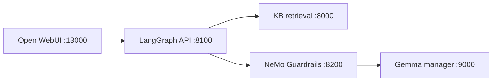

# Work Credit RAG — Phase 1

Umbrella repository for a self-hosted, Persian-capable conversational RAG platform. The implementation is split into independently maintained Git submodules so model/server operations, knowledge-base lifecycle, safety policy, and LangGraph orchestration can evolve without returning to a monolith.

## Repository composition

| Path | Repository | Current responsibility | Default branch |
|---|---|---|---|
| `components/server-setup` | [Work_RAG-Server-Setup](https://github.com/AliNikkhah2001/Work_RAG-Server-Setup) | H200 provisioning, local model and embedding services, Gemma manager, Open WebUI, infrastructure | `main` |
| `components/knowledgebase` | [Work_RAG-KB](https://github.com/AliNikkhah2001/Work_RAG-KB) | KB ingestion, maintenance, versioning, hybrid retrieval, reranking, KB web UI | `master` |
| `components/guardrails` | [Work_RAG-Guardrails](https://github.com/AliNikkhah2001/Work_RAG-Guardrails) | NeMo Guardrails policy service and guarded Gemma gateway | `main` |
| `components/orchestrator` | [Work_RAG-Orchestrator](https://github.com/AliNikkhah2001/Work_RAG-Orchestrator) | LangGraph workflow and public OpenAI-compatible chat API | `main` |

Each gitlink is pinned to an exact commit. Updating a component requires a component-repository commit followed by a parent-repository commit that advances the corresponding gitlink.

## MVP target

The first goal is one small, deterministic, observable request path—not the full production architecture:



Request order:

```text
frontend
  -> orchestrator input-policy check
  -> KB hybrid retrieval
  -> context construction
  -> guarded Gemma generation
  -> citation-shaped response
  -> frontend
```

The MVP deliberately excludes long-term memory, PostgreSQL LangGraph checkpoints, query rewriting, agent loops, retrieval retries, streaming, GraphRAG, multi-agent routing, and Kubernetes. Those come after the basic path is reliable.

The detailed, dependency-ordered plan and acceptance tests are in [docs/MVP_INTEGRATION_PLAN.md](docs/MVP_INTEGRATION_PLAN.md).

## Clone

This repository contains nested submodules: Work RAG KB itself contains a `kb-source` submodule. Clone recursively:

```bash
git clone --recurse-submodules https://github.com/AliNikkhah2001/Work_Credit-RAG_Phase1.git
cd Work_Credit-RAG_Phase1
```

If the repository was already cloned:

```bash
git submodule sync --recursive
git submodule update --init --recursive
```

Inspect the pinned component revisions:

```bash
git submodule status --recursive
```

## Current verified boundaries

The plan is based on the code currently present in the component repositories:

- Server Setup's manager exposes `GET /health`, `GET /v1/models`, and `POST /v1/chat/completions` on port `9000`. The selected MVP model is `gemma-4-31b`.
- Server Setup runs Open WebUI on port `13000` and must be configured to call the orchestrator rather than the model manager directly.
- KB Manager exposes its UI on port `8000`; current retrieval is `POST /search/api` with `query` and `top_k`, returning `final_results` after BM25, dense retrieval, RRF, and cross-encoder reranking.
- Guardrails and Orchestrator are newly initialized component repositories; their READMEs define the first contracts to implement.

## Ownership rule

Code belongs in the repository that owns its concern:

- hardware, model lifecycle, container infrastructure, and frontend wiring -> Server Setup;
- source documents, ingestion, indexing, retrieval, reranking, and KB evaluation -> Knowledgebase;
- Colang/policy configuration and guarded model access -> Guardrails;
- graph state, node order, dependency adapters, and the public chat API -> Orchestrator;
- cross-repository contracts, pinned revisions, integrated startup, and end-to-end acceptance -> this parent repository.

Do not duplicate component implementation in the parent repository.

## Updating a submodule

```bash
cd components/orchestrator
git switch main
git pull --ff-only
cd ../..
git add components/orchestrator
git commit -m "chore: advance orchestrator submodule"
```

Always run the contract and end-to-end tests before advancing a production pin.

## License

See [LICENSE](LICENSE). Each submodule may also declare its own license and dependency obligations.
