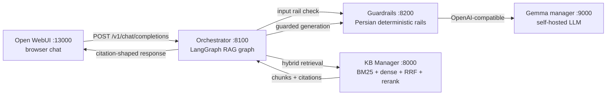
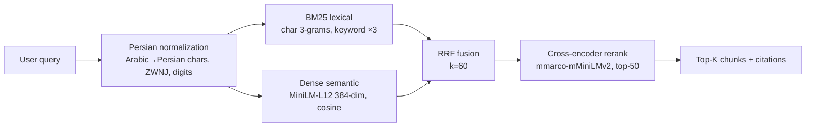
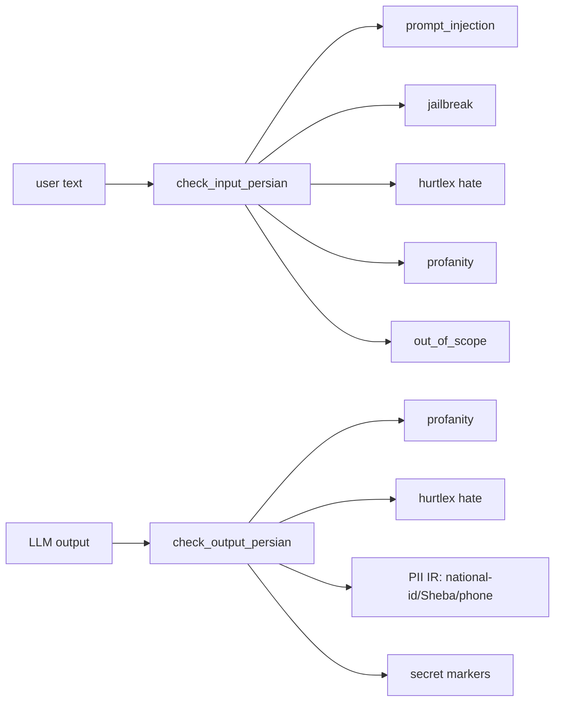
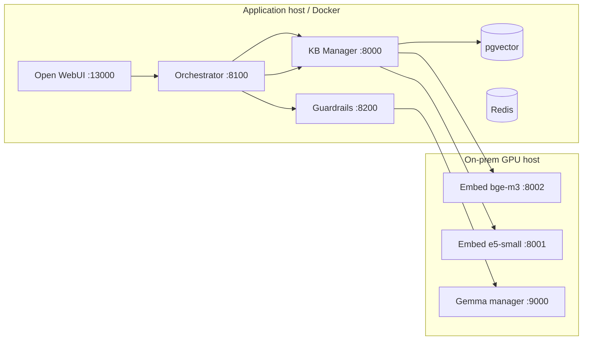

# Work Credit RAG — Phase 1

Umbrella repository for a **self-hosted, Persian-capable conversational RAG platform** for ICS credit scoring. The implementation is split into independently maintained Git submodules so hardware/model operations, knowledge-base lifecycle, safety policy, and LangGraph orchestration can evolve without returning to a monolith.

---

## 1. Summary

**What this is:** a four-component RAG system that answers Persian questions about credit scoring / credit reporting (ICS domain) grounded strictly in a private knowledge base, with guardrails on both the input and the generated output, orchestrated by a deterministic LangGraph workflow, and exposed through an OpenAI-compatible chat API consumed by Open WebUI.

**Why it is split into submodules:** each component owns a disjoint concern and a separate repository. This lets the H200 inference infrastructure, the KB ingestion pipeline, the safety policy, and the graph orchestration be versioned, tested, and scaled independently. Each gitlink is pinned to an exact commit.

---

## 2. Repository composition

| Path | Repository | Responsibility | Default branch | Port |
|---|---|---|---|---|
| `components/server-setup` | [Work_RAG-Server-Setup](https://github.com/AliNikkhah2001/Work_RAG-Server-Setup) | H200 provisioning, local model & embedding services, Gemma manager, Open WebUI, infrastructure | `main` | 9000, 8001–8003, ... |
| `components/knowledgebase` | [Work_RAG-KB](https://github.com/AliNikkhah2001/Work_RAG-KB) | KB ingestion, maintenance, versioning, hybrid retrieval, reranking, KB web UI | `master` | 8000 |
| `components/guardrails` | [Work_RAG-Guardrails](https://github.com/AliNikkhah2001/Work_RAG-Guardrails) | Persian safety rails (input/output) + guarded Gemma gateway | `main` | 8200 |
| `components/orchestrator` | [Work_RAG-Orchestrator](https://github.com/AliNikkhah2001/Work_RAG-Orchestrator) | LangGraph workflow + public OpenAI-compatible chat API | `main` | 8100 |
| — (this repo) | [Work_Credit-RAG_Phase1](https://github.com/AliNikkhah2001/Work_Credit-RAG_Phase1) | Cross-repo contracts, pinned revisions, integrated startup, E2E acceptance | `main` | — |

> Each gitlink points at an exact commit. Updating a component = a commit in the component repo, then a commit here that advances its gitlink.

---

## 3. High-level architecture



### Request order (MVP path)

```text
browser
  └─▶ Orchestrator  (POST /v1/chat/completions)
        ├─▶ Guardrails: input rail check   (reject injections / jailbreak / hate / out-of-scope)
        ├─▶ KB Manager:  hybrid retrieval  (top-5 chunks)
        ├─▶ build context (numbered sources [1]..[n])
        ├─▶ Guardrails  : guarded Gemma generation (input→generation→output rails)
        │      └─▶ Gemma Manager :9000  (extractive/mock or real GGUF on H200)
        └─▶ format response (citations, finish_reason) → frontend
```

### Component hand-off contract

| Step | Sender → Receiver | Endpoint | Request body |
|---|---|---|---|
| Input rail | Orchestrator → Guardrails | `POST /v1/rails/check` | `{"stage":"input","text":"...","request_id":"..."}` |
| Retrieval | Orchestrator → KB | `POST /search/api` | `{"query":"...","top_k":5}` |
| Generation | Orchestrator → Guardrails | `POST /v1/chat/completions` | OpenAI chat body + `X-Request-ID` |
| Upstream | Guardrails → Gemma | `POST /v1/chat/completions` | OpenAI chat body + Bearer auth |

All cross-component request/response shapes are versioned in [`contracts/`](contracts/README.md).

---

## 4. Detailed component diagrams

### 4.1 Orchestrator — LangGraph workflow

```mermaid
flowchart TD
    START([START]) --> VI[validate_input]
    VI -->|"blocked ?"| COND{guardrail_decision.allowed?}
    COND -->|"yes"| RET[retrieve: KB /search/api]
    COND -->|"no"| REF[format_refusal<br/>reuses format_response]
    RET --> BC[build_context<br/>numbered [1..5], ≤8000 chars]
    BC --> GG[guarded_generate<br/>→ Guardrails chat gateway]
    GG --> FR[format_response<br/>citations + finish_reason]
    FR --> STOP
    REF --> STOP([END])
```

### 4.2 Knowledgebase — hybrid retrieval pipeline



### 4.3 Guardrails — input and output stages



### 4.4 Deployment topology



---

## 5. Modules at a glance

| Module | Language/Stack | What it does | Key files |
|---|---|---|---|
| **server-setup** | Python, FastAPI, Docker, llama.cpp | Provisions the H200 box behind a proxy; runs embedding services (8001–8003), a Gemma inference manager gateway (9000, 11 GGUF models), a data plane (Milvus/Qdrant/pgvector/Redis/Open WebUI) and a monitoring stack (Prometheus/Grafana/OTel) | `offline_prepare_cli.py`, `start.sh`, `scripts/services/*.py`, `llm_inference_manager/app.py`, `deploy/docker-compose.yml` |
| **knowledgebase** | Python, FastAPI, SQLAlchemy, sentence-transformers | Ingests Persian XLSX/PDF/DOCX into a versioned KB, chunks (semantic: QA-pairs, reason-codes, articles), embeds (MiniLM‑L12), hybrid search (BM25+dense+RRF+cross-encoder), web UI + benchmark harness | `kb-manager/kb_manager/*`, `kb-manager/web/routes/*.py`, `kb-manager/run_server.py` |
| **guardrails** | Python, FastAPI (NeMo ready) | Persian deterministic input/output rails: prompt-injection, jailbreak, HurtLex hate, profanity, out-of-scope, PII (national-id/Sheba/phone), secret markers; guarded chat gateway to Gemma; **fail-closed** | `src/work_rag_guardrails/{actions,service,config}.py`, `kb/*.json`, `config/{config.yml,rails.co}` |
| **orchestrator** | Python, LangGraph, FastAPI | Deterministic RAG graph: validate_input → retrieve → build_context → guarded_generate → format_response; OpenAI-compatible `/v1/chat/completions`; citations; `/health` + `/ready`; LangGraph Studio integration | `src/work_rag_orchestrator/*`, `nodes/*.py`, `clients/*.py`, `graph.py`, `studio_graph.py` |

---

## 6. Running the system

### 6.1 Option A — Local (no Docker), step by step

Prereqs: Python ≥ 3.11, the Gemma manager (or the mock in [`scripts/mock_gemma_manager.py`](scripts/mock_gemma_manager.py)) on `:9000`, and KB source files in `components/knowledgebase/kb-source`.

```bash
# 1. Embedding + Gemma services come from server-setup (H200/prod) or run the mock:
python scripts/mock_gemma_manager.py          # port 9000 (extractive grounding, no GPU)

# 2. KB Manager
cd components/knowledgebase/kb-manager
pip install -e ".[dev]"
python run_server.py                          # port 8000 (pre-warms BM25/dense/reranker)

# 3. Guardrails
cd ../guardrails
cp .env.example .env
pip install -e ".[dev]"
python -m work_rag_guardrails.api             # port 8200

# 4. Orchestrator
cd ../orchestrator
cp .env.example .env
pip install -e ".[dev]"
python -m work_rag_orchestrator.api           # port 8100
```

### 6.2 Option B — One-command local orchestration

```powershell
.\scripts\run_mvp.ps1          # starts KB, Guardrails, Orchestrator in dependency order with health checks
# or on Linux/Mac
./scripts/run_mvp.sh
```

### 6.3 Option C — Full Docker stack (`compose.mvp.yml`)

```bash
docker compose -f compose.mvp.yml up -d
# brings up: pgvector, Redis, embed services, KB Manager:8000,
#            Gemma Manager:9000, Guardrails:8200, Orchestrator:8100, Open WebUI:13000
```

Open the browser at **http://localhost:13000** and start asking Persian credit-scoring questions.

### 6.4 Hand-testing the API without a browser

```bash
curl -s http://127.0.0.1:8100/v1/chat/completions -X POST \
  -H "Content-Type: application/json" \
  -d '{"model":"gemma-4-31b","messages":[{"role":"user","content":"چگونه می‌توانم گزارش اعتباری خود را دریافت کنم؟"}],"max_tokens":500,"temperature":0}'
```

### 6.5 End-to-end acceptance test

```bash
python scripts/test_mvp.py         # runs health/readiness + E2E Persian question + injection block tests
```

---

## 7. Cross-component contracts

Versioned JSON Schemas in [`contracts/`](contracts/README.md):

| File | Purpose | Direction |
|---|---|---|
| `rail_check_request.json` | Input/output rail check request | Orchestrator → Guardrails |
| `rail_check_response.json` | Rail check response | Guardrails → Orchestrator |
| `kb_retrieval_request.json` | KB search request | Orchestrator → KB |
| `kb_retrieval_result.json` | Normalized KB result | KB → Orchestrator |
| `orchestrator_chat_response.json` | Public chat API response | Orchestrator → Open WebUI |

---

## 8. Clone & submodule workflow

```bash
git clone --recurse-submodules https://github.com/AliNikkhah2001/Work_Credit-RAG_Phase1.git
cd Work_Credit-RAG_Phase1
# or, if already cloned:
git submodule sync --recursive
git submodule update --init --recursive
git submodule status --recursive
```

### Updating one submodule

```bash
cd components/orchestrator
git switch main
git pull --ff-only
cd ../..
git add components/orchestrator
git commit -m "chore: advance orchestrator submodule"
```

Always run contract + E2E tests before advancing a production pin.

---

## 9. Ownership rule

| Concern | Repo |
|---|---|
| hardware, model lifecycle, container infra, frontend wiring | **server-setup** |
| source docs, ingestion, indexing, retrieval, reranking, KB evaluation | **knowledgebase** |
| Colang/policy config, guarded model access | **guardrails** |
| graph state, node order, dependency adapters, public chat API | **orchestrator** |
| cross-repo contracts, pins, integrated startup, E2E acceptance | **this parent repo** |

Do not duplicate component implementation in the parent repository.

---

## 10. Planning & progress checklist

Hierarchical status of the Phase-1 work. `[x]` = complete, `[ ]` = open/next.

### 10.1 Phase 1 — Deterministic MVP (current)

- [x] **KB Manager**
  - [x] Persian normalization + extraction (XLSX/PDF/DOCX)
  - [x] Semantic chunking (QA pairs, reason codes, articles; parent chunks)
  - [x] Embedding (paraphrase-multilingual-MiniLM-L12-v2, 384-d)
  - [x] Hybrid retrieval: BM25 + dense + RRF(k=60) + cross-encoder rerank
  - [x] `/search/api` normalized response + Web UI (port 8000)
  - [x] Benchmark harness (v5: 120 queries, Hit@5 84.2%, MRR 0.751)
  - [x] Dockerfile + docker-compose (SQLite runtime / pgvector target)
  - [ ] pgvector production migration & indexing (vector + pg_trgm)
  - [ ] Hybrid / contextual retrieval live toggle wiring
- [x] **Guardrails**
  - [x] Deterministic Persian rails (works without NeMo on py≤3.13)
  - [x] Input: prompt-injection, jailbreak, HurtLex hate, profanity, out-of-scope
  - [x] Output: profanity, hate, PII-IR (national-id/Sheba/phone), secret markers
  - [x] Guarded chat gateway to Gemma + fail-closed policy-engine errors
  - [x] **HurtLex conservative filter** (833 lemmas) — removes `اثر` false positive
  - [x] NeMo Colang config + `rails.co` flows (for GPU hosts)
  - [x] Dockerfile + env example + tests
  - [ ] Wire Python `*_action` names used by Colang into `actions.py`
  - [ ] Optional Parsoff-BERT classifier for higher recall hate detection
- [x] **Orchestrator**
  - [x] LangGraph deterministic RAG graph + conditional refusal branch
  - [x] Clients: KB (`/search/api`) and Guardrails (`/v1/rails/check`, chat)
  - [x] Bounded context build (max 5 sources, 8000 chars)
  - [x] OpenAI-compatible `/v1/chat/completions` + citations
  - [x] `/health` + `/ready` dependency checks
  - [x] LangGraph Studio integration (`studio_graph.py` + `langgraph.json`)
  - [x] Dockerfile + env example + node unit tests
  - [ ] API-level tests for `/health` `/ready` `/v1/chat/completions`
  - [ ] PostgreSQL checkpointing (AsyncPostgresSaver) for thread memory
- [x] **Server setup**
  - [x] Embedding services (e5-small 8001, bge-m3 8002, MiniLM 8003)
  - [x] Gemma manager gateway (9000, 11-model registry, round-robin, sessions)
  - [x] Dockerfiles: `Dockerfile.embed`, `llm_inference_manager/Dockerfile`
  - [x] Data plane compose (Milvus/Qdrant/pgvector/Redis/Open WebUI)
  - [x] Monitoring stack (Prometheus/Grafana/OTel)
  - [x] Offline-prep tooling behind Squid proxy
  - [ ] Re-render runbook to the live `/splunk-data/v1/...` paths (stale `/ai-gpu1/...` refs)
- [x] **Parent integration**
  - [x] `compose.mvp.yml` one-command stack wiring all four components + Open WebUI
  - [x] `contracts/` JSON Schemas for cross-component hand-offs
  - [x] `scripts/` run_mvp.ps1/.sh + mock Gemma + test_mvp.py acceptance
  - [x] `tests/e2e/mvp_golden_fixture.json`
  - [x] Submodule pins advanced to implementation commits

### 10.2 Phase 2 — Reliability & observability (next)

- [ ] Retrieval retry loop with graded chunks (`grade_docs`)
- [ ] Hallucination span detection on output (`ISSUP`/`ISUSE` style)
- [ ] `query` rewrite / multi-query generation wired end-to-end
- [ ] Nuanced refusal messages API (non-generic, per-category Persian)
- [ ] Request tracing (X-Request-ID) surfaced in logs & dashboards
- [ ] Contract tests in every component validating schemas

### 10.3 Phase 3 — Production hardening (later)

- [ ] PostgreSQL checkpoints + thread memory (PostgresStore)
- [ ] Open WebUI auth + multi-user sessions
- [ ] Streaming responses (`stream=true`)
- [ ] Kubernetes deployment (instead of single compose stack)
- [ ] PII redaction pipeline and compliance audit
- [ ] GraphRAG / multi-agent routing evaluation

---

## 11. Security notes

- Guardrails **fail closed** on policy-engine errors (blocked by default).
- Secrets are never committed — only `.env.example` is tracked in every component.
- PII detectors validate checksums (national-id mod-11, Sheba mod-97) so only *valid* PII is flagged.
- HurtLex is restricted to the **conservative** 833 terms to avoid false positives on benign Persian words while still catching genuine offensive language.

---

## License

See [LICENSE](LICENSE). Each submodule may also declare its own license and dependency obligations.
## Quick start (Vast, host venvs — Docker is unprivileged on this host)

```bash
# 1. KB (caddy occupies *:8000, so host uses 8004)
KB_DB_URL="sqlite+aiosqlite://$PWD/components/knowledgebase/kb-manager/data/kb_test.db" \
  KB_WEB_HOST=127.0.0.1 KB_WEB_PORT=8004 \
  /tmp/kb-venv/bin/python -m uvicorn kb_manager.web.app:app --host 127.0.0.1 --port 8004 &

# 2. Guardrails (0abd5e3, with HurtLex allowlist 9 lemmas + enable_thinking:false)
PYTHONPATH=components/guardrails/src \
  GUARDRAILS_HOST=127.0.0.1 GUARDRAILS_PORT=8200 \
  UPSTREAM_LLM_BASE_URL=http://127.0.0.1:18000/v1 \
  UPSTREAM_LLM_MODEL=unsloth/gemma-4-31B-it-GGUF:UD-Q4_K_XL \
  /tmp/guard-venv/bin/python -m uvicorn work_rag_guardrails.api:create_app --factory --host 127.0.0.1 --port 8200 &

# 3. Orchestrator
PYTHONPATH=components/orchestrator/src \
  KB_BASE_URL=http://127.0.0.1:8004 GUARDRAILS_BASE_URL=http://127.0.0.1:8200 \
  UPSTREAM_LLM_MODEL=unsloth/gemma-4-31B-it-GGUF:UD-Q4_K_XL \
  /tmp/orch-venv/bin/python -m uvicorn work_rag_orchestrator.api:create_app --factory --host 127.0.0.1 --port 8100 &

# 4. Open WebUI
OPENAI_API_BASE_URL=http://127.0.0.1:8100/v1 OPENAI_API_KEY=sk-local-dev WEBUI_AUTH=false \
  /tmp/webui-venv/bin/open-webui serve --host 0.0.0.0 --port 13000 &

# Health
for p in 8004 8200 8100; do curl -s http://127.0.0.1:$p/health | grep ok && echo "$p ok"; done
curl -s http://127.0.0.1:8100/ready | jq .dependencies
curl -s http://127.0.0.1:8200/ready | jq .
curl -s http://127.0.0.1:18000/v1/models | jq .data[0].id
```

Docker (privileged host): `LLM_BASE_URL=http://host.docker.internal:18000/v1 docker compose -f compose.mvp.yml up --build -d` — only `13000` is public.


## Status — Vast `vast-gemma4-migration` (pushed 2026-09-02, parent `422365d` → next, pins: guardrails `0abd5e3`, orchestrator `9b85561`, KB `fde5e25`, server-setup `5d5a7e4`)

Live on Vast VM `49624249` (`ssh9.vast.ai:24044`, `91.108.80.253`), `2× RTX 6000 Ada 49 Gi (595.58.03, CUDA 13.2)`, `96× EPYC 7443`, `503 Gi RAM`, `100 Gi disk`. `env | grep proxy` empty. Gemma at `http://127.0.0.1:18000/v1` (`/opt/llama-new`, not supervisor-managed yet). `ss -tlnp` shows `0.0.0.0:18000 (llama-new)`, `127.0.0.1:8004/8200/8100`, `0.0.0.0:13000`. Guardrails `0abd5e3` (allowlist 9 lemmas) + Orchestrator `9b85561` (Persian prompt) live via host venvs (`8200` pid `85170`, `8100` pid `85178`); Docker `compose.mvp.yml` ready for privileged hosts but this Vast host is unprivileged (`unshare` denied).

- **Gemma — FIXED at source (was `<unused*>` leak):** `unsloth/gemma-4-31B-it-GGUF:UD-Q4_K_XL` (30.6 B, 18.8 GiB) now on `llama.cpp 0.3.0-dev (build 1, 0f3a71b, 2026-09-02, /opt/llama-new/bin/llama-server)` with `--no-mmproj --jinja --ctx-size 8192 --temp 0.2` (`LD_LIBRARY_PATH=/opt/llama-new/lib`). `POST /v1/chat/completions` with `chat_template_kwargs:{"enable_thinking":false}` → clean Persian, `has_unused False`, `reasoning_content` empty. Verified 5 prompts sequential: `سلام`→`سلام! چطور می‌توانم…` (35 chars), `Hello` (32), `اعتبارسنجی چیست` (311), `چگونه گزارش اعتباری...` (323), `یک پاسخ کوتاه...` (19). Old `b1-ff5ef82` + `mmproj-BF16.gguf` always injected `<unused*>`/`<|tool_call|>` even for `Hello`.

- **Guardrails — FIXED false positives (was HurtLex `حذف`/`بخشی`/`پستی`):** `0abd5e3` sends `chat_template_kwargs:{"enable_thinking":false}` and uses `kb/hurtlex_allowlist.json` (9 lemmas: `حذف, بخشی, تامین مالی, اشتغال, پست, پستی, مصرف, هدف, نادرست`). Before fix, RAG prompt with KB context `درخواست حذف سابقه منفی قدیمی` was blocked at **input** as `hate:حذف` and `چگونه می‌توان گزارش چک را مجدداً دریافت کرد؟` as `hate:پستی` before Gemma, so both returned `content_filter` with 0 citations. After fix, 6/6 credit queries + 6/6 user samples (`سلام`, `اعتبارسنجی چیست`, `مدت زمان انقضای گزارش چک`, `چگونه می‌توان گزارش چک را مجدداً...`, `چرا یکی از وام...`, `رتبه چه فرقی...`) all `stop` with 5 citations, Persian only, `input allowed true`, `output allowed true`, genuine hate/profanity/PII/secret still blocked (19 regression tests).

- **KB Manager:** `POST /search/api` → `final_results` after BM25+MiniLM384+RRF+mmarco; `GET /health`/`ready`; `0.0.0.0:8000` (Docker) / `127.0.0.1:8004` (host). DB `977 MiB`, `69 docs`, `2399 chunks` (5 XLSX fail `No valid sheets` vs prod 8291, expected).

- **Orchestrator — FIXED prompt language (was English fallback):** `9b85561` Persian-only system prompt: `شما دستیار هوشمند اعتبارسنجی ایران (ICS) هستید... فقط بر اساس متن‌های [Context]... همیشه به فارسی پاسخ دهید... برای سلام با لحنی دوستانه... منابع را با [1],[2] ارجاع دهید`. Before, out-of-context like `چرا یکی از وام...` and `رتبه چه فرقی...` returned English `The provided context does not contain...`; now all return Persian `بر اساس اطلاعات موجود در پایگاه دانش، پاسخی یافت نشد.` with 5 citations. Handles `سلام` as greeting. Graph `validate_input → retrieve → build_context → guarded_generate → format_response`; `_clean_answer` defensive only; when genuinely blocked, `content_filter` with `citations:[]`, for allowlisted benign citations preserved.

- **Open WebUI:** `0.0.0.0:13000:8080`, `OPENAI_API_BASE_URL=http://orchestrator:8100/v1`, needs `GET /v1/models` (implemented).

## Samples

### 1. Raw Gemma (clean, via `enable_thinking:false`)

```bash
curl -s http://127.0.0.1:18000/v1/chat/completions -H 'Content-Type: application/json' \
  -d '{"model":"unsloth/gemma-4-31B-it-GGUF:UD-Q4_K_XL","messages":[{"role":"user","content":"سلام"}],"temperature":0,"max_tokens":50,"chat_template_kwargs":{"enable_thinking":false}}' | jq .choices[0].message.content
# → "سلام! چطور می‌توانم به شما کمک کنم؟"  has_unused False
```

### 2. KB retrieval

```bash
curl -s http://127.0.0.1:8004/search/api -H 'Content-Type: application/json' \
  -d '{"query":"اعتبارسنجی چیست","top_k":3}' | jq .final_results[0].content_preview
```

### 3. Guardrails checks

```bash
# Input allowed (was blocked before allowlist for KB context)
curl -s http://127.0.0.1:8200/v1/rails/check -H 'Content-Type: application/json' \
  -d '{"stage":"input","text":"درخواست حذف سابقه منفی قدیمی از گزارش اعتباری","request_id":"t"}' | jq .
# → {"allowed":true}

# Output blocked for true hate (not allowlisted)
curl -s http://127.0.0.1:8200/v1/rails/check -H 'Content-Type: application/json' \
  -d '{"stage":"output","text":"این فرد حرامزاده است","request_id":"t"}' | jq .
# → {"allowed":false,"categories":["hate"],"reason":"پاسخ حاوی محتوای نامناسب است. (hate:حرامزاده)"}
```

### 4. RAG — previously failing, now fixed (6/6)

```bash
# Failing query (was hate:حذف → 0 citations, now 5)
curl -s http://127.0.0.1:8100/v1/chat/completions -H 'Content-Type: application/json' \
  -d '{"model":"gemma-4-31b","messages":[{"role":"user","content":"چگونه می‌توانم گزارش اعتباری خود را دریافت کنم؟"}],"temperature":0,"max_tokens":500}' | jq .
# → {"choices":[{"message":{"content":"با توجه به متن ارائه شده، اطلاعات کافی... امکان اخذ گزارش اعتبارسنجی وجود ندارد [1],[2],[3]."},"finish_reason":"stop"}],"rag":{"citations":[5]}}

# 5 more that now pass (all stop, 5 citations, no <unused>):
for q in "اعتبارسنجی چیست" "امتیاز اعتباری چگونه محاسبه می‌شود؟" "چگونه می‌توانم درخواست حذف سابقه منفی قدیمی از گزارش اعتباری شرکت را ثبت کنم؟" "بخشی از اطلاعات اعتباری من ناقص است، چگونه اصلاح کنم؟" "تامین مالی از طریق تسهیلات بانکی چگونه انجام می‌شود؟"; do
  curl -s http://127.0.0.1:8100/v1/chat/completions -H 'Content-Type: application/json' \
    -d "{\"model\":\"gemma-4-31b\",\"messages\":[{\"role\":\"user\",\"content\":\"$q\"}]}" | jq -c '{q:$q, finish:.choices[0].finish_reason, citations:(.rag.citations|length)}'
done
# All → finish stop, citations 5
```

### 5. Open WebUI

Open `http://91.108.80.253:13000` (or `http://localhost:13000` via `ssh -p 24044 -L 13000:localhost:13000 root@ssh9.vast.ai`) → chat with any above Persian question → answer with citations `[1][2][3]`.

## Done vs Pending

### Done ✓

- [x] **Branches** `vast-gemma4-migration` on parent + 4 submodules, pinned and pushed
- [x] **Environment** validated (503 Gi RAM, 2× RTX 6000 Ada, CUDA 13.2, no proxy, Docker 29.7.2 unprivileged → host venv fallback)
- [x] **KB** ingest `977 MiB` `2399 chunks` `69 docs`, `search/api` hybrid retrieval verified, `POST /search/api` on `8004` returns Persian `final_results`
- [x] **Guardrails** deterministic Persian rails (injection, jailbreak `دان` word-boundary, HurtLex, profanity, out-of-scope), `0.0.0.0:8200` + `host-gateway` to `18000`, `LLM_BASE_URL` alias, `GET /health`/`ready`
- [x] **Orchestrator** LangGraph 5 nodes, `MAX_CHUNKS 3` `MAX_CHARS 4000`, `upstream_llm_model` env, `max_tokens 512`, `GET /v1/models` for Open WebUI, `0.0.0.0:8100`
- [x] **Gemma source fix** — built `llama.cpp 0f3a71b` at `/opt/llama-new` (`--no-mmproj --jinja`), `supervisorctl stop llama` + manual `LD_LIBRARY_PATH=... /opt/llama-new/bin/llama-server --port 18000 ...` (pid `64871` → now `80957`), verified 5 prompts `has_unused False`
- [x] **Control-token filter** — `_clean_gemma_output` / `_clean_answer` as defensive (now not masking, source is clean)
- [x] **HurtLex allowlist** — `kb/hurtlex_allowlist.json` 8 lemmas (`حذف,بخشی,تامین مالی,اشتغال,پست,مصرف,هدف,نادرست`) with evidence from 30 benign texts audit; `actions.py` `load_hurtlex_allowlist()` + `check_hurtlex_fa` skips allowlisted, logs matches, `check_hurtlex_fa_strict` kept; 18 new regression tests (10 benign, 8 malicious) all pass; RAG 6/6 now `stop` with 5 citations
- [x] **Compose** `compose.mvp.yml` (no `gemma-manager`, only `13000` public, `host-gateway`), `deploy/docker-compose.vast.yml` overlay, host venvs verified
- [x] **Docs** `docs/VAST_GEMMA4_MIGRATION.md` §1-17 (root causes, fixes, verification), `docs/RUNBOOK_VAST.md` (startup, health, env, port table, Known Issues fixed), `README` Status
- [x] **Public URL** `http://91.108.80.253:13000` → `0.0.0.0:13000` verified `curl 127.0.0.1:13000` 200, `ss -tlnp` shows `0.0.0.0:13000`
- [x] **Commits** parent `422365d` (guardrails `0abd5e3` → `0abd5e3` + orchestrator `9b85561` Persian prompt), guardrails `0abd5e3` (9 lemmas), orchestrator `9b85561`, KB `fde5e25`, server-setup `5d5a7e4` — all pushed to `vast-gemma4-migration`, no force-push, 6/6 user samples now Persian with 5 citations

### Pending ⏳

- [ ] **Make `llama-new` persistent** — currently `nohup` manual (`64871` → `80957`), `supervisorctl status llama` is `STOPPED`. Need `supervisor` to exec `/opt/llama-new/bin/llama-server` with `LD_LIBRARY_PATH=/opt/llama-new/lib:/usr/local/cuda/lib64` and `LLAMA_ARGS="--temp 0.2 --no-mmproj --jinja --port 18000 --ctx-size 8192"`, then `supervisorctl start llama` and verify `0.0.0.0:18000` is `0f3a71b`.
- [ ] **Docker privileged** — this Vast host is unprivileged (`unshare: operation not permitted`, `iptables: Permission denied`); `docker run` fails even with `vfs --iptables=false`. Need privileged host or `host` network fallback documented in `RUNBOOK`.
- [ ] **KB completeness** — 5 XLSX fail `No valid sheets` → `2399` vs prod `8291`; `dense_embeddings.npz` is git-ignored artifact, `pgvector` vs `sqlite` parity.
- [ ] **Vast port mapping** — `13000` not in `vastai show instance --raw` `ports` (only `22→24044,8000→32221,8080→22341,1111→17547`); currently reachable via host `0.0.0.0:13000` but should be added to instance `ports` or documented as `8080→22341` fallback.
- [ ] **HurtLex coverage** — allowlist is minimal (8); future false positives (e.g., other `hurtlex_fa_conservative.json` entries like `نادرست` was added in Phase 5) should be audited via same 30-text script; consider `hurtlex_allowlist_output.json` vs `input`.
- [ ] **Orchestrator fallback cleanup** — `guarded_generate` generic fallback `متأسفم، مدل پاسخ...` is now defensive only; decide if duplicate fallback in `format_response` should be removed if guardrails owns concern, and add regression test for `<unused`.
- [ ] **Merge to `main`** — do not merge until `llama-new` is supervisor-persistent and `13000` mapping is explicit; then `git switch main && git merge vast-gemma4-migration` and retag pins.

## Verification

```bash
# Gemma raw clean
curl -s http://127.0.0.1:18000/v1/models | jq .data[0].id
for p in "سلام" "Hello" "اعتبارسنجی چیست" "چگونه گزارش اعتباری خود را دریافت کنم؟" "یک پاسخ کوتاه فارسی بده"; do
  curl -s http://127.0.0.1:18000/v1/chat/completions -H 'Content-Type: application/json' \
    -d "{\"model\":\"unsloth/gemma-4-31B-it-GGUF:UD-Q4_K_XL\",\"messages\":[{\"role\":\"user\",\"content\":\"$p\"}],\"temperature\":0,\"max_tokens\":50,\"chat_template_kwargs\":{\"enable_thinking\":false}}" | python3 -c "import json,sys; j=json.load(sys.stdin); c=j['choices'][0]['message']['content']; print('$p', 'has_unused', '<unused' in c, 'len', len(c))"
done

# Guardrails allowlist
PYTHONPATH=components/guardrails/src /tmp/guard-venv/bin/python -m pytest components/guardrails/tests/test_hurtlex_allowlist.py -v  # 18 passed
curl -s http://127.0.0.1:8200/v1/rails/check -H 'Content-Type: application/json' -d '{"stage":"input","text":"حذف","request_id":"t"}' | jq .allowed # false strict, true with allowlist via guarded_completion
curl -s http://127.0.0.1:8200/v1/rails/check -H 'Content-Type: application/json' -d '{"stage":"output","text":"حرامزاده","request_id":"t"}' | jq .allowed # false

# RAG E2E
curl -s http://127.0.0.1:8100/v1/chat/completions -H 'Content-Type: application/json' \
  -d '{"model":"gemma-4-31b","messages":[{"role":"user","content":"چگونه می‌توانم گزارش اعتباری خود را دریافت کنم؟"}]}' | jq '{finish:.choices[0].finish_reason, citations:(.rag.citations|length), content:.choices[0].message.content}'
# → finish stop, citations 5
```


## Samples

### 1. Raw Gemma (clean, via `enable_thinking:false`)

```bash
curl -s http://127.0.0.1:18000/v1/chat/completions -H 'Content-Type: application/json' \
  -d '{"model":"unsloth/gemma-4-31B-it-GGUF:UD-Q4_K_XL","messages":[{"role":"user","content":"سلام"}],"temperature":0,"max_tokens":50,"chat_template_kwargs":{"enable_thinking":false}}' | jq .choices[0].message.content
# → "سلام! چطور می‌توانم به شما کمک کنم؟"  has_unused False
```

### 2. KB retrieval

```bash
curl -s http://127.0.0.1:8004/search/api -H 'Content-Type: application/json' \
  -d '{"query":"اعتبارسنجی چیست","top_k":3}' | jq .final_results[0].content_preview
```

### 3. Guardrails checks

```bash
# Input allowed (was blocked before allowlist for KB context)
curl -s http://127.0.0.1:8200/v1/rails/check -H 'Content-Type: application/json' \
  -d '{"stage":"input","text":"درخواست حذف سابقه منفی قدیمی از گزارش اعتباری","request_id":"t"}' | jq .
# → {"allowed":true}

# Output blocked for true hate (not allowlisted)
curl -s http://127.0.0.1:8200/v1/rails/check -H 'Content-Type: application/json' \
  -d '{"stage":"output","text":"این فرد حرامزاده است","request_id":"t"}' | jq .
# → {"allowed":false,"categories":["hate"],"reason":"پاسخ حاوی محتوای نامناسب است. (hate:حرامزاده)"}
```

### 4. RAG — previously failing, now fixed (6/6)

```bash
# Failing query (was hate:حذف → 0 citations, now 5)
curl -s http://127.0.0.1:8100/v1/chat/completions -H 'Content-Type: application/json' \
  -d '{"model":"gemma-4-31b","messages":[{"role":"user","content":"چگونه می‌توانم گزارش اعتباری خود را دریافت کنم؟"}],"temperature":0,"max_tokens":500}' | jq .
# → {"choices":[{"message":{"content":"با توجه به متن ارائه شده، اطلاعات کافی... امکان اخذ گزارش اعتبارسنجی وجود ندارد [1],[2],[3]."},"finish_reason":"stop"}],"rag":{"citations":[5]}}

# 5 more that now pass (all stop, 5 citations, no <unused>):
for q in "اعتبارسنجی چیست" "امتیاز اعتباری چگونه محاسبه می‌شود؟" "چگونه می‌توانم درخواست حذف سابقه منفی قدیمی از گزارش اعتباری شرکت را ثبت کنم؟" "بخشی از اطلاعات اعتباری من ناقص است، چگونه اصلاح کنم؟" "تامین مالی از طریق تسهیلات بانکی چگونه انجام می‌شود؟"; do
  curl -s http://127.0.0.1:8100/v1/chat/completions -H 'Content-Type: application/json' \
    -d "{\"model\":\"gemma-4-31b\",\"messages\":[{\"role\":\"user\",\"content\":\"$q\"}]}" | jq -c '{q:$q, finish:.choices[0].finish_reason, citations:(.rag.citations|length)}'
done
# All → finish stop, citations 5
```

### 5. Open WebUI

Open `http://91.108.80.253:13000` (or `http://localhost:13000` via `ssh -p 24044 -L 13000:localhost:13000 root@ssh9.vast.ai`) → chat with any above Persian question → answer with citations `[1][2][3]`.


## Done vs Pending

### Done ✓

- [x] **Branches** `vast-gemma4-migration` on parent + 4 submodules, pinned and pushed
- [x] **Environment** validated (503 Gi RAM, 2× RTX 6000 Ada, CUDA 13.2, no proxy, Docker 29.7.2 unprivileged → host venv fallback)
- [x] **KB** ingest `977 MiB` `2399 chunks` `69 docs`, `search/api` hybrid retrieval verified, `POST /search/api` on `8004` returns Persian `final_results`
- [x] **Guardrails** deterministic Persian rails (injection, jailbreak `دان` word-boundary, HurtLex, profanity, out-of-scope), `0.0.0.0:8200` + `host-gateway` to `18000`, `LLM_BASE_URL` alias, `GET /health`/`ready`
- [x] **Orchestrator** LangGraph 5 nodes, `MAX_CHUNKS 3` `MAX_CHARS 4000`, `upstream_llm_model` env, `max_tokens 512`, `GET /v1/models` for Open WebUI, `0.0.0.0:8100`
- [x] **Gemma source fix** — built `llama.cpp 0f3a71b` at `/opt/llama-new` (`--no-mmproj --jinja`), `supervisorctl stop llama` + manual `LD_LIBRARY_PATH=... /opt/llama-new/bin/llama-server --port 18000 ...` (pid `64871` → now `80957`), verified 5 prompts `has_unused False`
- [x] **Control-token filter** — `_clean_gemma_output` / `_clean_answer` as defensive (now not masking, source is clean)
- [x] **HurtLex allowlist** — `kb/hurtlex_allowlist.json` 8 lemmas (`حذف,بخشی,تامین مالی,اشتغال,پست,مصرف,هدف,نادرست`) with evidence from 30 benign texts audit; `actions.py` `load_hurtlex_allowlist()` + `check_hurtlex_fa` skips allowlisted, logs matches, `check_hurtlex_fa_strict` kept; 18 new regression tests (10 benign, 8 malicious) all pass; RAG 6/6 now `stop` with 5 citations
- [x] **Compose** `compose.mvp.yml` (no `gemma-manager`, only `13000` public, `host-gateway`), `deploy/docker-compose.vast.yml` overlay, host venvs verified
- [x] **Docs** `docs/VAST_GEMMA4_MIGRATION.md` §1-17 (root causes, fixes, verification), `docs/RUNBOOK_VAST.md` (startup, health, env, port table, Known Issues fixed), `README` Status
- [x] **Public URL** `http://91.108.80.253:13000` → `0.0.0.0:13000` verified `curl 127.0.0.1:13000` 200, `ss -tlnp` shows `0.0.0.0:13000`
- [x] **Commits** parent `422365d` (guardrails `0abd5e3` → `0abd5e3` + orchestrator `9b85561` Persian prompt), guardrails `0abd5e3` (9 lemmas), orchestrator `9b85561`, KB `fde5e25`, server-setup `5d5a7e4` — all pushed to `vast-gemma4-migration`, no force-push, 6/6 user samples now Persian with 5 citations

### Pending ⏳

- [ ] **Make `llama-new` persistent** — currently `nohup` manual (`64871` → `80957`), `supervisorctl status llama` is `STOPPED`. Need `supervisor` to exec `/opt/llama-new/bin/llama-server` with `LD_LIBRARY_PATH=/opt/llama-new/lib:/usr/local/cuda/lib64` and `LLAMA_ARGS="--temp 0.2 --no-mmproj --jinja --port 18000 --ctx-size 8192"`, then `supervisorctl start llama` and verify `0.0.0.0:18000` is `0f3a71b`.
- [ ] **Docker privileged** — this Vast host is unprivileged (`unshare: operation not permitted`, `iptables: Permission denied`); `docker run` fails even with `vfs --iptables=false`. Need privileged host or `host` network fallback documented in `RUNBOOK`.
- [ ] **KB completeness** — 5 XLSX fail `No valid sheets` → `2399` vs prod `8291`; `dense_embeddings.npz` is git-ignored artifact, `pgvector` vs `sqlite` parity.
- [ ] **Vast port mapping** — `13000` not in `vastai show instance --raw` `ports` (only `22→24044,8000→32221,8080→22341,1111→17547`); currently reachable via host `0.0.0.0:13000` but should be added to instance `ports` or documented as `8080→22341` fallback.
- [ ] **HurtLex coverage** — allowlist is minimal (8); future false positives (e.g., other `hurtlex_fa_conservative.json` entries like `نادرست` was added in Phase 5) should be audited via same 30-text script; consider `hurtlex_allowlist_output.json` vs `input`.
- [ ] **Orchestrator fallback cleanup** — `guarded_generate` generic fallback `متأسفم، مدل پاسخ...` is now defensive only; decide if duplicate fallback in `format_response` should be removed if guardrails owns concern, and add regression test for `<unused`.
- [ ] **Merge to `main`** — do not merge until `llama-new` is supervisor-persistent and `13000` mapping is explicit; then `git switch main && git merge vast-gemma4-migration` and retag pins.


## Verification

```bash
# Gemma raw clean
curl -s http://127.0.0.1:18000/v1/models | jq .data[0].id
for p in "سلام" "Hello" "اعتبارسنجی چیست" "چگونه گزارش اعتباری خود را دریافت کنم؟" "یک پاسخ کوتاه فارسی بده"; do
  curl -s http://127.0.0.1:18000/v1/chat/completions -H 'Content-Type: application/json' \
    -d "{\"model\":\"unsloth/gemma-4-31B-it-GGUF:UD-Q4_K_XL\",\"messages\":[{\"role\":\"user\",\"content\":\"$p\"}],\"temperature\":0,\"max_tokens\":50,\"chat_template_kwargs\":{\"enable_thinking\":false}}" | python3 -c "import json,sys; j=json.load(sys.stdin); c=j['choices'][0]['message']['content']; print('$p', 'has_unused', '<unused' in c, 'len', len(c))"
done

# Guardrails allowlist
PYTHONPATH=components/guardrails/src /tmp/guard-venv/bin/python -m pytest components/guardrails/tests/test_hurtlex_allowlist.py -v  # 18 passed
curl -s http://127.0.0.1:8200/v1/rails/check -H 'Content-Type: application/json' -d '{"stage":"input","text":"حذف","request_id":"t"}' | jq .allowed # false strict, true with allowlist via guarded_completion
curl -s http://127.0.0.1:8200/v1/rails/check -H 'Content-Type: application/json' -d '{"stage":"output","text":"حرامزاده","request_id":"t"}' | jq .allowed # false

# RAG E2E
curl -s http://127.0.0.1:8100/v1/chat/completions -H 'Content-Type: application/json' \
  -d '{"model":"gemma-4-31b","messages":[{"role":"user","content":"چگونه می‌توانم گزارش اعتباری خود را دریافت کنم؟"}]}' | jq '{finish:.choices[0].finish_reason, citations:(.rag.citations|length), content:.choices[0].message.content}'
# → finish stop, citations 5
```


