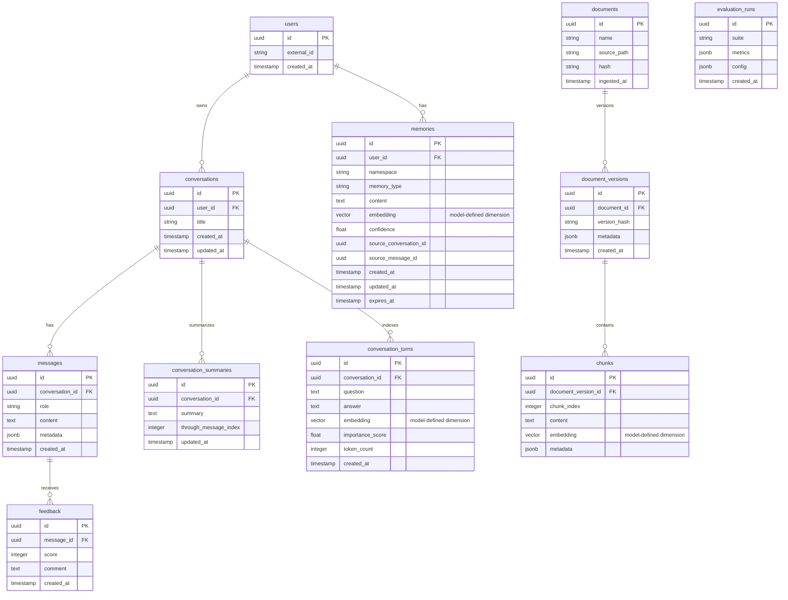
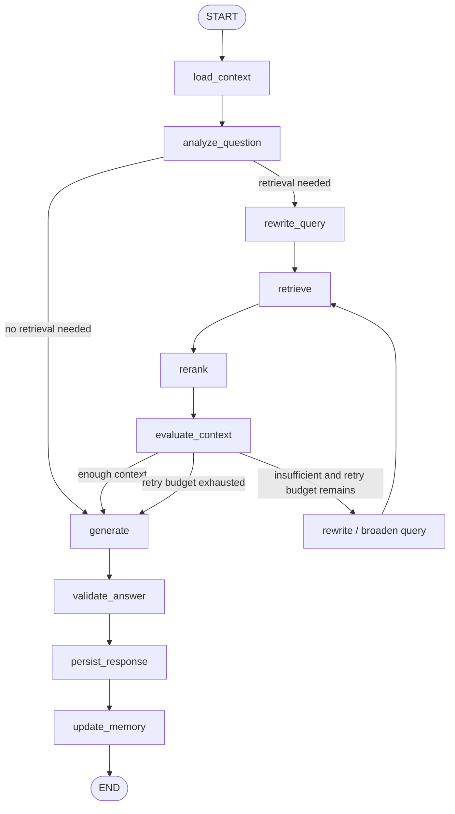
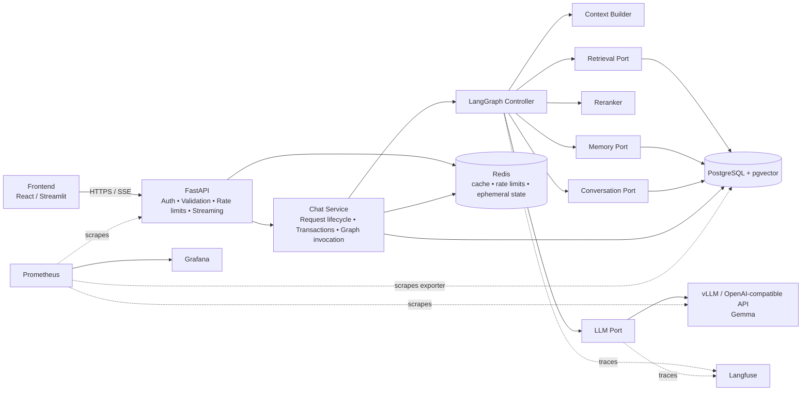
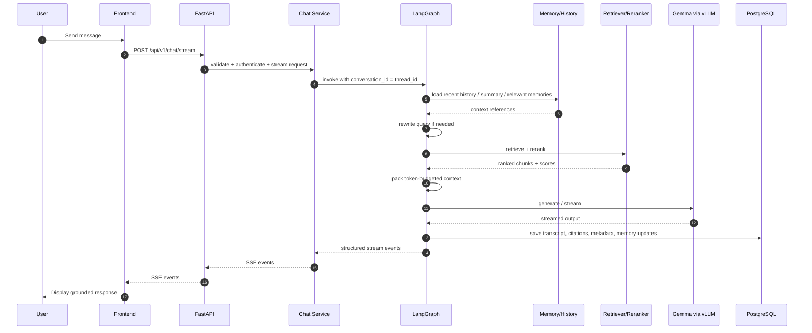
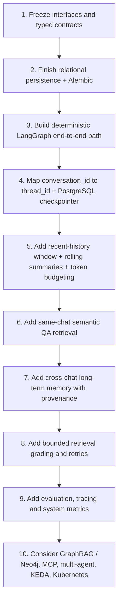

# 🧠 RAG Agent Platform

### *Production-Oriented, Self-Hosted Conversational RAG Runtime with Native Data Sovereignty*


> [!IMPORTANT]
> This repository is no longer treated as only a “RAG implementation.” The retrieval and reranking path and model-serving layer are assumed to exist; the primary engineering focus is the **application/runtime around RAG**: orchestration, persistence, memory, context management, streaming, failure handling, evaluation, and observability.

---

## ⚡ Tech Stack & Libraries Matrix

| Layer | Technology | Role |
| :--- | :--- | :--- |
| **Runtime** | Python 3.11+ | Application runtime |
| **API Layer** | FastAPI + Uvicorn | HTTP boundary, validation, auth, SSE streaming |
| **Workflow Runtime** | LangGraph 1.x | Explicit stateful orchestration, branching, retries, persistence |
| **LangChain Usage** | `langchain-core` selectively | Messages, model abstractions, structured output, tools where useful |
| **LLM Serving** | Gemma behind vLLM / OpenAI-compatible API | Independent inference service |
| **LLM Client** | Async OpenAI-compatible client | Thin HTTP client used by the application |
| **Retrieval** | Existing vector + keyword/BM25 retrieval | Knowledge access; independently testable from the LLM |
| **Reranking** | Existing reranker | Candidate ordering before context packing |
| **Primary Database** | PostgreSQL 16+ + pgvector | Durable source of truth, transcript, memories, documents, vectors |
| **Graph Persistence** | `langgraph-checkpoint-postgres` | Thread-scoped workflow checkpoints |
| **Caching / Ephemeral State** | Redis 7+ | Cache, rate limits, locks, temporary request/stream state |
| **DB Migrations** | Alembic | Relational schema migrations |
| **Structured Logging** | Structlog | Request-correlated application logs |
| **LLM / Graph Tracing** | Langfuse | LLM traces, graph execution traces, costs and scores |
| **System Metrics** | Prometheus + Grafana | API, database, retrieval, model-serving and infrastructure metrics |
| **Evaluation** | RAGAS + deterministic metrics | Retrieval, ranking, groundedness, citation and conversation evaluation |
| **Data Snapshots** | DVC | Reproducible datasets and document snapshots—not the live vector index |
| **Experiment Tracking** | MLflow | Prompt/model/config/evaluation experiment tracking |
| **Package Management** | uv | Dependency resolution and exact locking through `uv.lock` |
| **Containers** | Docker | Local and deployment packaging |
| **Production Orchestration** | Kubernetes later | Scale only after the core runtime is reliable |

> [!NOTE]
> Do not develop against an old `LangGraph 0.2+` assumption. The project targets the current LangGraph 1.x architecture, while deployable dependency versions are locked in `uv.lock`.

---

## 📌 Table of Contents

- [1. Introduction](#1-introduction)
- [2. Architecture Decisions](#2-architecture-decisions)
- [3. Architecture Boundaries & Design Patterns](#3-architecture-boundaries--design-patterns)
- [4. Target Project Structure](#4-target-project-structure)
- [5. Persistence & Database Model](#5-persistence--database-model)
- [6. Conversation Memory Model](#6-conversation-memory-model)
- [7. Context Builder & Token Budget](#7-context-builder--token-budget)
- [8. LangGraph Workflow](#8-langgraph-workflow)
- [9. Data Flow & System Diagrams](#9-data-flow--system-diagrams)
- [10. API & Streaming Contract](#10-api--streaming-contract)
- [11. Observability](#11-observability)
- [12. Evaluation Strategy](#12-evaluation-strategy)
- [13. DVC & MLflow Responsibilities](#13-dvc--mlflow-responsibilities)
- [14. Quick Start](#14-quick-start)
- [15. Implementation Roadmap](#15-implementation-roadmap)
- [16. Author & Maintainer](#16-author--maintainer)

---

## 1. Introduction

This repository defines a **self-hosted conversational Retrieval-Augmented Generation platform** built around a production-oriented runtime rather than a single retrieve-and-generate chain.

### Current baseline assumptions

The runtime design assumes that:

- the **Gemma generation model is already served** behind a network API;
- **retrieval and reranking already work** and should remain independently testable;
- a **minimal frontend already exists**;
- PostgreSQL/pgvector, Redis, observability, and deployment infrastructure remain part of the platform.

### Primary goal

Build one reliable production path in which:

```text
user sends a follow-up
→ FastAPI identifies the conversation
→ LangGraph restores thread state
→ relevant conversation memory is selected
→ the query is rewritten for retrieval when needed
→ existing retrieval + reranking run
→ context is packed under a token budget
→ Gemma streams a grounded answer
→ citations + metadata are persisted
→ the conversation survives application restarts
→ the next request continues correctly
```

### Key principles

- **Explicit orchestration:** LangGraph controls the workflow; business rules are visible as nodes, edges, and state.
- **Durable source of truth:** PostgreSQL owns user-visible data and durable memory.
- **Ephemeral Redis:** Redis accelerates the system but never becomes the canonical conversation store.
- **Independent retrieval:** the retriever can be tested without Gemma.
- **Thin API routes:** FastAPI validates/authenticates and delegates to services.
- **Bounded agentic behavior:** retries and loops have deterministic limits.
- **Token-aware context:** never pass the user's entire conversation history blindly.
- **Evaluation before complexity:** measure the core RAG runtime before GraphRAG, MCP, multi-agent systems, KEDA, or Kubernetes complexity.

---

## 2. Architecture Decisions

### 2.1 LangChain vs. LangGraph

LangChain and LangGraph serve different abstraction levels and are not treated as competing choices.

| Question | LangChain | LangGraph |
| :--- | :--- | :--- |
| **Primary role** | Components and higher-level agent framework | Workflow/orchestration runtime |
| **Abstraction** | Higher | Lower / explicit |
| **Entry point** | Prebuilt agent/model/tool APIs | `StateGraph` and explicit nodes/edges |
| **Control flow** | Standardized agent loops | First-class branching and arbitrary bounded loops |
| **State** | Agent state | Explicit typed workflow state |
| **Persistence** | Via underlying graph/runtime | Core feature |
| **Conversation threads** | Supported | First-class `thread_id` model |
| **Human approval / resume** | Supported | Native interrupt/resume workflow model |
| **Best fit here** | Selective primitives | **Primary orchestration layer** |

**Project decision:**

```text
LangGraph
    ↓
custom application graph
    ↓
langchain-core selectively
    ├── message objects
    ├── model abstraction if useful
    ├── structured output
    └── tool abstraction later

application-owned code
    ├── retrieval
    ├── reranking
    ├── repositories
    ├── context builder
    └── memory policy
```

Do not rebuild working retrieval/reranking through high-level LangChain chains simply because an integration exists.

### 2.2 Component responsibilities

```text
LangGraph          = control flow
Gemma              = reasoning / generation engine
Retriever/Reranker = knowledge-access engine
PostgreSQL         = durable source of truth
Redis              = temporary / fast state
FastAPI            = external application boundary
Langfuse           = LLM / workflow trace visibility
Prometheus/Grafana = system and service metrics
```

### 2.3 PostgreSQL transcript vs. LangGraph checkpoints

Both are required because they solve different problems.

```text
messages table
    = canonical user-visible transcript

LangGraph checkpoints
    = internal workflow execution state
```

The `messages` table supports UI history, search, audit, exports, feedback, analytics, conversation listing, and deletion.

Graph checkpoints support continuation, state recovery, retries, interrupt/resume, debugging, and in-flight workflow state.

> [!WARNING]
> Do not make the frontend read LangGraph's internal checkpoint tables directly.

### 2.4 PostgreSQL vs. Redis

PostgreSQL stores durable data. Redis stores short-lived or reconstructable data.

**Redis is appropriate for:**

- request and retrieval caches;
- rate limiting;
- distributed locks;
- active request state;
- temporary stream state;
- background-job coordination;
- short-lived session information.

A useful architecture test is: **if Redis disappears, users should not lose their conversations.**

### 2.5 Alembic vs. DVC vs. MLflow

| Tool | Responsibility |
| :--- | :--- |
| **Alembic** | Relational database schema migrations |
| **DVC** | Reproducible data/document/evaluation snapshots |
| **MLflow** | Experiment tracking for model/config/prompt/evaluation variants |

They are complementary, not interchangeable.

---

## 3. Architecture Boundaries & Design Patterns

### 3.1 Enforced dependency boundary

```text
API
 │
 ▼
SERVICE
 │
 ▼
LANGGRAPH
 │
 ├─────────► LLM PORT
 │
 ├─────────► RETRIEVAL PORT
 │
 ├─────────► MEMORY PORT
 │
 └─────────► CONVERSATION PORT
                │
                ▼
          REPOSITORIES
                │
                ▼
            DATABASE
```

LangGraph should know an interface such as:

```python
results = await retriever.search(query)
```

not database-specific SQL.

FastAPI should know:

```python
return chat_service.stream(...)
```

not graph-internal calls such as `graph.astream(...)`.

### 3.2 Design patterns

- 🏬 **Repository Pattern**: isolates PostgreSQL/SQLAlchemy access from business logic.
- ⚙️ **Service Layer Pattern**: owns request lifecycle, transactions, orchestration and application rules.
- 🎯 **Strategy Pattern**: swaps vector, keyword/BM25 and hybrid retrieval strategies.
- 🏭 **Factory / Adapter Pattern**: configures LLM clients/providers without leaking serving details into graph logic.
- 🔌 **Dependency Injection**: injects repositories, ports and services into FastAPI routes and graph nodes.
- 🚪 **Ports & Adapters**: keeps LangGraph dependent on application interfaces rather than infrastructure implementations.
- 🧱 **Context Builder**: centralizes prompt/context assembly and token budgeting.

### 3.3 Interfaces to freeze first

Define stable contracts before expanding the graph:

```text
LLMClient
Retriever
Reranker
ConversationRepository
MemoryRepository
ContextBuilder
```

Use typed Pydantic/domain models at boundaries instead of loosely structured dictionaries.

---

## 4. Target Project Structure

```text
.
├── .env.example
├── .gitignore
├── .pre-commit-config.yaml
├── README.md
├── Makefile
├── pyproject.toml
├── uv.lock
├── alembic.ini
├── docker-compose.yml
├── migrations/
│   └── versions/
├── data/                         # DVC-managed reproducible snapshots
│   ├── evaluation/
│   ├── document_snapshots/
│   └── experiments/
├── scripts/
│   ├── seed_data.py
│   └── run_ragas_eval.py
├── src/
│   └── app/
│       ├── __init__.py
│       ├── main.py
│       ├── core/
│       │   ├── config.py
│       │   ├── logging.py
│       │   └── exceptions.py
│       ├── api/
│       │   ├── deps.py
│       │   ├── router.py
│       │   └── v1/
│       │       ├── chat.py
│       │       ├── conversations.py
│       │       └── feedback.py
│       ├── services/
│       │   ├── chat/
│       │   │   └── service.py
│       │   ├── agent/
│       │   │   ├── graph.py
│       │   │   ├── state.py
│       │   │   └── nodes/
│       │   │       ├── load_context.py
│       │   │       ├── analyze_question.py
│       │   │       ├── rewrite_query.py
│       │   │       ├── retrieve.py
│       │   │       ├── rerank.py
│       │   │       ├── evaluate_context.py
│       │   │       ├── generate.py
│       │   │       ├── validate_answer.py
│       │   │       ├── persist_response.py
│       │   │       └── update_memory.py
│       │   ├── context/
│       │   │   ├── builder.py
│       │   │   └── budget.py
│       │   ├── retrieval/
│       │   │   ├── service.py
│       │   │   └── strategies/
│       │   ├── reranking/
│       │   │   └── service.py
│       │   ├── memory/
│       │   │   ├── service.py
│       │   │   └── policy.py
│       │   └── llm/
│       │       ├── client.py
│       │       └── factory.py
│       ├── ports/
│       │   ├── llm.py
│       │   ├── retrieval.py
│       │   ├── memory.py
│       │   └── conversation.py
│       ├── db/
│       │   ├── session.py
│       │   ├── models/
│       │   │   ├── user.py
│       │   │   ├── conversation.py
│       │   │   ├── message.py
│       │   │   ├── conversation_summary.py
│       │   │   ├── conversation_turn.py
│       │   │   ├── memory.py
│       │   │   ├── document.py
│       │   │   ├── document_version.py
│       │   │   ├── chunk.py
│       │   │   ├── feedback.py
│       │   │   └── evaluation_run.py
│       │   └── repositories/
│       │       ├── conversation_repo.py
│       │       ├── memory_repo.py
│       │       └── document_repo.py
│       ├── schemas/
│       │   ├── chat.py
│       │   ├── conversation.py
│       │   └── events.py
│       ├── streaming/
│       │   └── events.py
│       └── monitoring/
│           ├── metrics.py
│           └── tracer.py
├── tests/
│   ├── conftest.py
│   ├── unit/
│   ├── integration/
│   └── evaluation/
└── frontend/
    ├── app.py
    └── requirements.txt
```

> [!NOTE]
> This structure is a target boundary map. Exact filenames can evolve, but the separation between API, service, graph, ports, repositories, context, memory, retrieval, and infrastructure should remain intact.

---

## 5. Persistence & Database Model

### 5.1 Durable entities

The persistence layer should evolve beyond only conversations/messages/documents/chunks/feedback toward:

```text
users
organizations                 # optional, if multi-tenant

conversations
messages
conversation_summaries
conversation_turns

memories

documents
document_versions
chunks

feedback
evaluation_runs
```

### 5.2 Core ER model



### 5.3 Embedding dimension rule

Do **not** hard-code `vector(1536)` unless the selected embedding model actually emits 1536 dimensions.

Use the embedding model's real output dimension:

```text
vector(<YOUR_EMBEDDING_DIM>)
```

The generation model and embedding model are independent; Gemma does not determine pgvector dimensions.

### 5.4 Conversation ID and graph thread ID

Use the conversation identifier as the LangGraph thread identifier:

```python
config = {
    "configurable": {
        "thread_id": str(conversation_id)
    }
}
```

For production persistence use PostgreSQL-backed LangGraph checkpoints, not an in-memory saver that disappears on restart.

---

## 6. Conversation Memory Model

A conversational RAG system needs several memory layers with different scopes and retention rules.

| Memory layer | Example | Scope | Storage | Every prompt? |
| :--- | :--- | :--- | :--- | :--- |
| **Working graph state** | current retrieval results | one graph run | LangGraph state | yes, when needed |
| **Recent conversation** | latest exact messages | current chat | PostgreSQL / checkpointer | usually |
| **Thread summary** | compressed older history | current chat | PostgreSQL | usually, budget permitting |
| **Old same-chat QA** | relevant decision from 70 turns ago | current chat | PostgreSQL + vector search | only when relevant |
| **Cross-chat memory** | stable preference or project decision | user across chats | long-term memory store | only when relevant |

### 6.1 Recent exact history + rolling summary

Do not keep appending every message ever sent to a prompt.

Use:

```text
OLD HISTORY
    ↓
rolling summary

RECENT HISTORY
    ↓
verbatim window
```

### 6.2 Same-conversation semantic recall

Older details can be indexed as searchable conversation turns:

```text
conversation_turns
------------------
id
conversation_id
question
answer
embedding
created_at
importance_score
token_count
```

Queries must be scoped to the active conversation so old same-chat context is retrieved without contaminating other threads.

### 6.3 Cross-chat long-term memory

Cross-thread memory is separate from LangGraph thread continuity.

A memory record should retain provenance:

```text
memories
----------------------
id
user_id
namespace
memory_type
content
embedding
confidence
source_conversation_id
source_message_id
created_at
updated_at
expires_at
```

Suggested memory types:

```text
fact
preference
project_decision
goal
conversation_episode
```

Do not dump all previous conversations into a new chat. Retrieve only memories relevant to the current user/query/namespace.

---

## 7. Context Builder & Token Budget

Prompt assembly should be centralized in a `ContextBuilder` rather than reimplemented independently by graph nodes.

### 7.1 Context inputs

```text
system instructions
        +
current user question
        +
recent messages
        +
rolling conversation summary
        +
relevant old QA from this thread
        +
relevant cross-thread memory
        +
retrieved document chunks
```

### 7.2 Token-budget model

```text
MODEL CONTEXT WINDOW
──────────────────────────────────────────
reserved output tokens
reserved safety margin

SYSTEM
CURRENT QUESTION

RECENT CHAT
THREAD SUMMARY

RELEVANT OLD QA
RELEVANT LONG-TERM MEMORY

RAG DOCUMENTS
──────────────────────────────────────────
```

Do not assign every source a fixed percentage. Give sources priorities and fill until the available token budget is reached.

For a factual RAG question, an example priority is:

```text
system
> current question
> RAG evidence
> recent history
> relevant previous QA
> conversation summary
> cross-chat memories
```

For a question such as “What did I tell you earlier?”, history and memory should outrank external document retrieval.

---

## 8. LangGraph Workflow

### 8.1 Typed state

Keep graph state explicit and typed. A conceptual state contract is:

```python
class AgentState(TypedDict):
    messages: list
    user_id: str
    conversation_id: str

    current_query: str
    standalone_query: str

    conversation_summary: str
    relevant_history: list
    long_term_memories: list

    retrieved_chunks: list
    reranked_chunks: list

    retrieval_score: float
    retry_count: int

    answer: str
    citations: list
    error: str | None
```

Large documents should generally be represented by IDs/references rather than repeatedly copied into persistent checkpoints.

### 8.2 Initial deterministic graph

Start with the simplest complete end-to-end workflow:

```text
load_context
→ rewrite_query
→ retrieve
→ rerank
→ generate
→ persist
```

Make that path reliable before adding more agentic behavior.

### 8.3 Target graph



### 8.4 Query rewriting

Keep the original user question and a retrieval-oriented standalone query separately.

```text
current_query
standalone_query
```

Example:

```text
Conversation:
User: What is speculative decoding?
User: Does Gemma support it?

Retrieval query:
Does the selected Gemma model support speculative decoding?
```

The displayed user message remains unchanged.

### 8.5 Bounded retrieval retries

LangGraph supports cycles, but the system must not permit uncontrolled search loops.

Start with a deterministic bound such as:

```text
max retrieval attempts = 2
```

Evaluate retrieval quality using deterministic signals first, including:

- top reranker score;
- score distribution;
- number of valid results;
- document diversity;
- metadata filter satisfaction.

Add an LLM context grader only where deterministic signals are insufficient.

---

## 9. Data Flow & System Diagrams

### 9.1 High-level architecture



### 9.2 Controller-owned retrieval and generation

The retriever should not own the LLM call.

```text
                    ┌─→ Retriever
LangGraph Controller│
                    └─→ LLM
```

This keeps retrieval independently testable and makes retrieval evaluation much easier.

### 9.3 Memory-aware request lifecycle



### 9.4 Final memory mental model

```text
                         USER
                          │
                          ▼
                  CURRENT QUESTION
                          │
            ┌─────────────┼──────────────┐
            │             │              │
            ▼             ▼              ▼

        RECENT CHAT    THREAD MEMORY   USER MEMORY
        exact turns    same chat       cross chats
                       summary
                       old QA

            │             │              │
            └─────────────┼──────────────┘
                          │
                          ▼
                  QUERY INTERPRETER
                          │
                          ▼
                  RETRIEVAL QUERY
                          │
                          ▼
                DOCUMENT RETRIEVAL
                          │
                          ▼
                      RERANKER
                          │
                          ▼
                   CONTEXT PACKER
                          │
                          ▼
                       GEMMA
                          │
                          ▼
                 GROUNDED RESPONSE
                          │
                          ▼
                SAVE + UPDATE MEMORY
```

---

## 10. API & Streaming Contract

### 10.1 FastAPI responsibilities

FastAPI routes should remain intentionally thin:

```python
validate()
authenticate()
call_service()
return_or_stream()
```

Retrieval, prompt construction, reranking, graph orchestration, generation and persistence belong below the route layer.

### 10.2 Suggested endpoints

```text
POST /api/v1/conversations
GET  /api/v1/conversations
GET  /api/v1/conversations/{id}
GET  /api/v1/conversations/{id}/messages
POST /api/v1/chat/stream
POST /api/v1/messages/{id}/feedback
```

### 10.3 Structured SSE events

Prefer structured server-sent events over an untyped raw-token stream.

```text
event: message_start

event: retrieval
data: {"documents": 6}

event: token
data: {"text": "PostgreSQL"}

event: citation
data: {...}

event: message_complete
data: {...}
```

SSE is a good default when the dominant communication direction during generation is server → browser. WebSockets can be added only when a true bidirectional real-time requirement appears.

---

## 11. Observability

Use Langfuse and Prometheus/Grafana for different layers of visibility.

| Layer | Important measurements |
| :--- | :--- |
| **HTTP** | request count, status codes, p50/p95/p99 latency |
| **Retrieval** | latency, candidates returned, recall-related signals |
| **Reranker** | latency, ranking delta |
| **Context** | tokens inserted, chunks inserted, truncation decisions |
| **LLM** | TTFT, generation latency, token counts, tokens/sec |
| **Graph** | node latency, retry count, branch selected |
| **Memory** | memories retrieved, summary frequency, memory writes |
| **Database** | query latency, errors, connection-pool saturation |
| **Product** | feedback, completion, conversation-level success signals |

Propagate correlation identifiers through the full request path:

```text
request_id
trace_id
user_id
conversation_id
message_id
```

Debugging should be traceable end-to-end:

```text
frontend error
   ↓ request_id
FastAPI log
   ↓ trace_id
LangGraph execution
   ↓
retrieval / reranker trace
   ↓
LLM trace
```

> [!IMPORTANT]
> Prometheus should scrape backend and infrastructure services. Do **not** model the browser/frontend as directly pushing normal backend metrics into Prometheus.

Typical scrape targets include:

```text
FastAPI /metrics
PostgreSQL exporter
vLLM metrics
Redis exporter (if used)
```

---

## 12. Evaluation Strategy

Evaluation should be built **before** GraphRAG or more autonomous agent behavior.

Measure components separately so failures can be localized.

| Component | Metric / signal |
| :--- | :--- |
| **Retriever** | Recall@K |
| **Ranker** | MRR / NDCG |
| **Context** | relevant-chunk coverage |
| **Generator** | correctness |
| **RAG answer** | groundedness |
| **Citations** | citation precision |
| **Conversation** | follow-up consistency |
| **Memory** | previous-fact recall |
| **Performance** | TTFT / p95 latency |

A single aggregate answer-quality score is not enough. The evaluation pipeline should answer:

```text
Did retrieval fail?
Did reranking fail?
Did context packing drop useful evidence?
Did the generator ignore good context?
Did citation generation misattribute evidence?
Did conversation memory fail to recall a prior decision?
```

Keep `scripts/run_ragas_eval.py`, but pair RAGAS with deterministic retrieval/ranking/performance measurements and a versioned golden QA/conversation dataset.

---

## 13. DVC & MLflow Responsibilities

### 13.1 DVC

Good DVC candidates:

```text
evaluation datasets
document snapshots
chunking experiment corpora
training / fine-tuning data
```

The live PostgreSQL/pgvector index is operational database state and should **not** use DVC as its source of truth.

DVC can store reproducible snapshots used to rebuild or evaluate that state.

### 13.2 MLflow

Use MLflow first for experiment tracking:

```text
embedding model version
reranker version
prompt version
chunking configuration
generation configuration
evaluation results
experiment comparisons
```

A large model-registry workflow is optional and should not block the runtime buildout, especially when the generation model is already served independently.

---

## 14. Quick Start

### 14.1 Clone the repository

```bash
git clone https://github.com/your-org/rag-agent-platform.git
cd rag-agent-platform
```

### 14.2 Initialize the environment with `uv`

```bash
uv venv
source .venv/bin/activate  # Windows: .venv\Scripts\activate
uv sync --extra dev --extra monitoring
```

Exact dependency versions are resolved through `uv.lock`.

### 14.3 Configure environment variables

```bash
cp .env.example .env
```

Example serving boundary:

```dotenv
LLM_BASE_URL=http://llm-service:8000/v1
LLM_MODEL=your-served-gemma-model
DATABASE_URL=postgresql+psycopg://...
REDIS_URL=redis://...
```

The FastAPI application should communicate with the independently served model over HTTP. It should **not** import vLLM and load a large Gemma model into the API process.

### 14.4 Configure pre-commit hooks

```bash
pre-commit install
```

### 14.5 Launch local infrastructure

```bash
make docker-up
```

The local stack should provide infrastructure such as PostgreSQL/pgvector and Redis. Model serving can remain a separately scaled service.

### 14.6 Apply migrations

```bash
alembic upgrade head
```

### 14.7 Start the API

```bash
make dev
```

Default development endpoints:

```text
API:          http://localhost:8000
OpenAPI:      http://localhost:8000/docs
Metrics:      http://localhost:8000/metrics
```

### 14.8 Test and evaluate

```bash
pytest
python scripts/run_ragas_eval.py
```

---

## 15. Implementation Roadmap

The roadmap is intentionally ordered by engineering dependency rather than speculative calendar dates.



### Milestone 1 — Interfaces and persistence

- Define `LLMClient`, `Retriever`, `Reranker`, `ConversationRepository`, and `MemoryRepository`.
- Add user ownership, conversations, messages, summaries, searchable turns, memories, document versions and evaluation records.
- Make PostgreSQL the canonical user-visible transcript store.

### Milestone 2 — Reliable deterministic graph

Implement:

```text
load_context
→ rewrite_query
→ retrieve
→ rerank
→ generate
→ persist
```

Verify one full conversation path before adding retries or complex memory behavior.

### Milestone 3 — Durable thread continuity

- Set `conversation_id == LangGraph thread_id`.
- Add PostgreSQL-backed checkpoints.
- Verify continuation after API restart.

### Milestone 4 — Context management

- exact recent-message window;
- rolling conversation summary;
- token-aware context packing;
- source-priority rules.

### Milestone 5 — Same-chat and cross-chat memory

- semantic retrieval over older turns within the active conversation;
- long-term user/project memory across conversations;
- provenance, confidence and expiration rules.

### Milestone 6 — Bounded agentic retrieval

Add context grading and retry/broaden behavior only after the deterministic graph is stable. Enforce retry limits and record why each retry happened.

### Milestone 7 — Evaluation and observability

- golden QA and conversation datasets;
- retrieval/ranking/generation/citation/memory metrics;
- Langfuse graph and LLM tracing;
- Prometheus/Grafana system metrics;
- request/trace correlation IDs.

### Later — advanced platform features

Only after the core path is reliable should the project prioritize:

- GraphRAG / Neo4j;
- MCP integrations;
- multi-agent architectures;
- KEDA autoscaling;
- broader Kubernetes complexity.

---

## 16. Author & Maintainer


**Project Author**  
👋 Lead architect behind the RAG Agent Platform.  
Building high-performance, agentic, enterprise-oriented AI systems with clean boundaries, data sovereignty, durable memory, evaluation, and robust telemetry.

<p>
    <a href="https://github.com/your-username"></a>
    <a href="https://linkedin.com/in/your-profile"></a>
    <a href="https://twitter.com/your-handle"></a>
    <a href="mailto:you@domain.com"></a>
</p>

### ⭐ If this blueprint helps your project, consider starring the repository.

[Back to top](#-rag-agent-platform)
