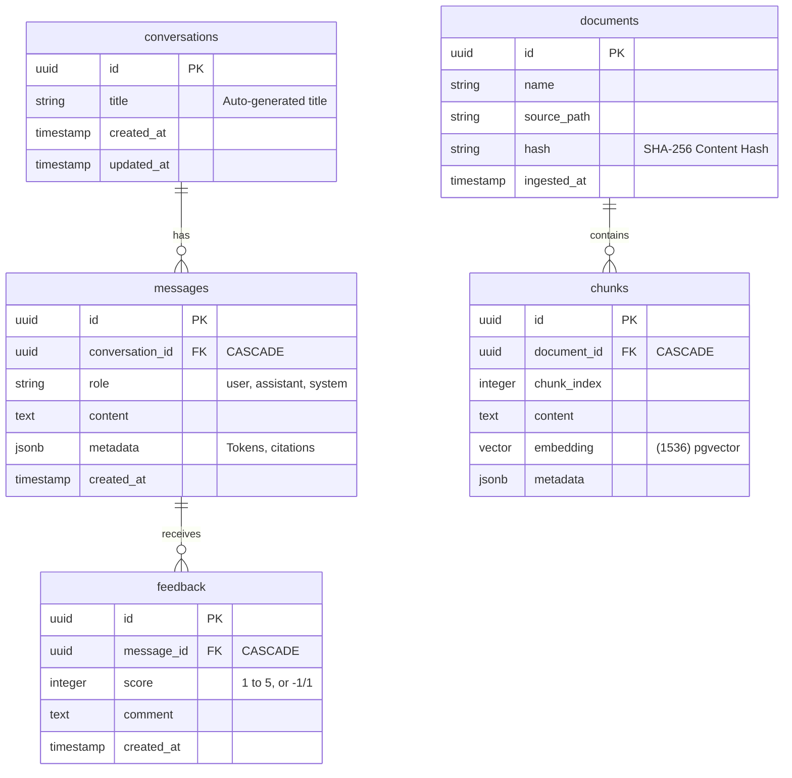
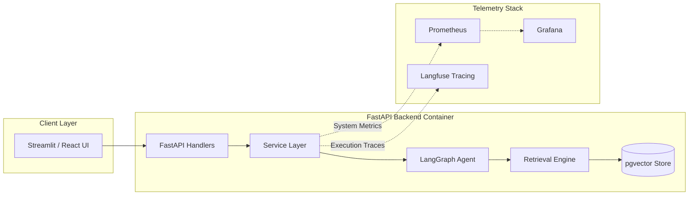
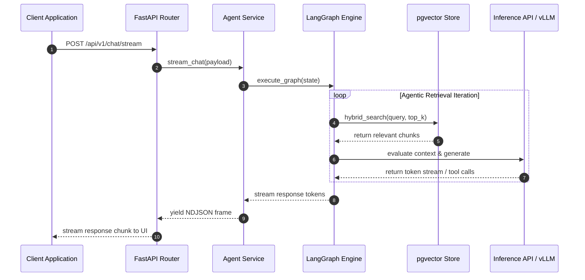
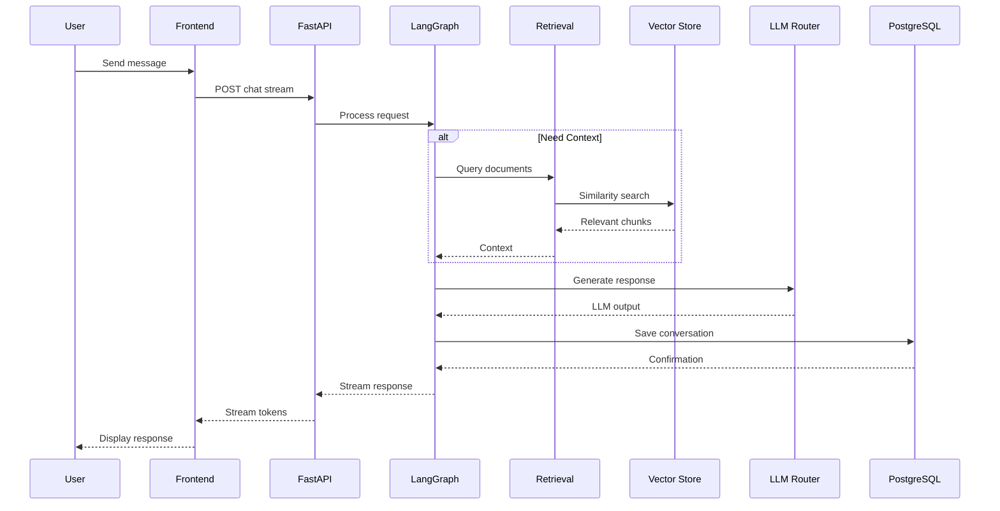
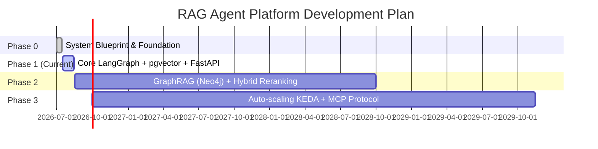

# 🧠 RAG Agent Platform

### *Production-Ready, Self-Hosted Agentic AI with Native Data Sovereignty*


---

## ⚡ Tech Stack & Libraries Matrix

| Layer | Technology | Badge |
| :--- | :--- | :--- |
| **Runtime** | Python 3.11+ |  |
| **API Layer** | FastAPI |  |
| **Agent Loop** | LangGraph |  |
| **Vector DB** | PostgreSQL + pgvector |  |
| **Caching** | Redis |  |
| **LLM Serving** | vLLM / Ollama |  |
| **Metrics** | Prometheus + Grafana |  |
| **LLM Tracing** | Langfuse |  |
| **Data Versioning** | DVC |  |
| **Model Registry** | MLflow |  |
| **Package Manager** | uv (Astral) |  |
| **Orchestration** | Docker + K8s |  |

---

> [!IMPORTANT]
> **Production-Ready RAG Blueprint:** This repository houses a clean, scalable, and fully deterministic RAG agent baseline built with **LangGraph**, **pgvector**, **FastAPI**, and enterprise observability hooks.

---

## 📸 System In Action

```text
+-----------------------------------------------------------------------+
| [User Query] -> (LangGraph Agent) -> [Hybrid Search (Vector + BM25)]  |
|                                                                       |
| [Streamed Response] <- (vLLM Engine) <- [Reranked Context Blocks]     |
+-----------------------------------------------------------------------+
```

---

## 📌 Table of Contents

- [📖 1. Introduction](#1-introduction)
- [🛠 2. Tool Architecture Decisions](#2-tool-architecture-decisions)
- [🏗️ 3. Design Patterns](#3-design-patterns)
- [📂 4. Project File Structure](#4-project-file-structure)
- [🗄️ 5. Database Schema](#5-database-schema)
- [🔄 6. Data Flow & System Diagrams](#6-data-flow--system-diagrams)
- [🧪 7. Technology Stack Reference](#7-technology-stack-reference)
- [🚀 8. Step-by-Step Setup & CI/CD Workflow](#8-step-by-step-setup--cicd-workflow)
- [🗺️ 9. Project Roadmap](#9-project-roadmap)
- [👤 10. Author & Maintainer](#10-author--maintainer)

---

## 1. 📖 Introduction

This repository is a **production-ready, self-hosted Retrieval-Augmented Generation (RAG) Agent platform**. It bridges the gap between simple semantic search and production autonomy by using a **LangGraph-driven agentic feedback loop** with hybrid search, streaming dynamic memory, and end-to-end data control.

### Key Highlights

- **Deterministic Deployment**: Locked dependencies via `uv` and enforced pre-commit validation.
- **Deep Observability**: Out-of-the-box infrastructure metrics with Prometheus/Grafana, paired with LLM call tracing via Langfuse.
- **Modularity First**: Loose coupling via repository, strategy, and factory patterns for easy component swapping.

---

## 2. 🛠 Tool Architecture Decisions

<details>
<summary><b>🔍 Expand Tool Comparisons & Decisions</b></summary>

### Model Versioning: MLflow vs. DVC

| Aspect | **MLflow** | **DVC** |
| :--- | :--- | :--- |
| **Scope** | Full ML Lifecycle (Tracking, Registry, Serving) | Data Version Control + Pipeline Orchestration |
| **Strengths** | Tracks LLM prompts, parameters, metrics. Native LangChain/LangGraph integration. | Versions massive datasets (PDFs, embeddings) without storing blobs in Git. |
| **Weaknesses** | Heavy for simple model storage. Does not handle large data files efficiently. | No built-in experiment tracking. |
| **Decision** | **Use Both.** MLflow handles **Experiment Tracking** (prompts, token costs) and **Model Registry**. DVC handles **Data Versioning** (raw documents, chunked text, and embedding indices). |

### Observability: Langfuse vs. Prometheus vs. Grafana

| Aspect | **Langfuse** | **Prometheus + Grafana** |
| :--- | :--- | :--- |
| **Scope** | LLM-specific Observability (Traces, Costs, Scoring) | System Infrastructure Metrics (CPU, Memory, Request Latency) |
| **Strengths** | Tracks prompt templates, generation latency, token usage per user. | Industry standard for collecting time-series metrics and visualizing dashboards. |
| **Decision** | **Use Both.** Langfuse handles the **Tracing** (What did the LLM see?). Prometheus+Grafana handles the **System** (How much load can the API take?) for SLOs. |

### Data Migration: Alembic vs. DVC

| Aspect | **Alembic** | **DVC** |
| :--- | :--- | :--- |
| **Scope** | Relational Database Schema Migrations (SQLAlchemy). | Versioning large binary/text files outside Git. |
| **Decision** | **Use Both.** Alembic tracks **Table Structures**. DVC tracks **Data Files**. They serve entirely different purposes.
</details>

---

## 3. 🏗️ Design Patterns

- 🏬 **Repository Pattern** (`app/db/repositories/`): Isolates database access operations from business logic.
- ⚙️ **Service Layer Pattern** (`app/services/`): Encapsulates application workflows and business rules.
- 🎯 **Strategy Pattern** (`app/services/retrieval/strategies/`): Enables runtime swapping between vector, keyword, and hybrid search pipelines.
- 🏭 **Factory Pattern** (`app/services/llm/factory.py`): Instantiates and configures LLM providers dynamically based on context.
- 🔌 **Dependency Injection** (`app/api/deps.py`): Injects database sessions and service layers cleanly into FastAPI routes.

---

## 4. 📂 Project File Structure

```text
.
├── .env.example                 # Template for required env vars
├── .gitignore                   # Standard Python + OS + IDE
├── .pre-commit-config.yaml      # Ruff, mypy, trailing-whitespace checks
├── README.md                    # This file
├── Makefile                     # Shortcuts: dev, docker-up, test, migrate
├── pyproject.toml               # Build system, dependencies, ruff/mypy configs
├── uv.lock                      # Exact dependency versions
├── docker-compose.yml           # Postgres+pgvector, Redis, (optional) Grafana
├── data/                        # Managed by DVC (gitignored)
│   ├── raw_documents/
│   └── embeddings/
├── models/                      # Managed by MLflow (gitignored)
│   └── model_registry/
├── scripts/                     # One-off scripts
│   ├── seed_data.py
│   └── run_ragas_eval.py
├── src/                         # Main application source
│   └── app/
│       ├── __init__.py
│       ├── main.py              # FastAPI app creation & lifespan
│       ├── core/                # Cross-cutting concerns
│       │   ├── config.py        # Pydantic Settings
│       │   ├── logging.py       # Structlog configuration
│       │   └── exceptions.py
│       ├── api/                 # HTTP Layer
│       │   ├── deps.py          # Depends (DB session, current user)
│       │   ├── router.py        # Routes aggregator
│       │   └── v1/              # Version 1 endpoints
│       │       ├── chat.py      # POST /chat/stream
│       │       └── conv.py      # CRUD for conversations
│       ├── services/            # Business Logic Layer
│       │   ├── agent/           # LangGraph integration
│       │   │   ├── graph.py
│       │   │   └── state.py
│       │   ├── retrieval/       # RAG logic
│       │   │   ├── vector_store.py
│       │   │   └── strategies/  # Strategy Pattern
│       │   └── llm/             # LLM clients
│       │       ├── router.py
│       │       └── factory.py
│       ├── db/                  # Data Access Layer
│       │   ├── session.py
│       │   ├── models/          # SQLAlchemy ORM models
│       │   │   ├── conversation.py
│       │   │   └── message.py
│       │   └── repositories/    # Repository Pattern
│       │       └── conversation_repo.py
│       ├── schemas/             # Pydantic v2 DTOs
│       │   ├── chat.py
│       │   └── conversation.py
│       └── monitoring/          # Prometheus/Langfuse instrumentation
│           ├── metrics.py
│           └── tracer.py
├── tests/                       # Testing
│   ├── conftest.py
│   ├── unit/
│   └── integration/
└── frontend/                    # Minimal Streamlit UI
    ├── app.py
    └── requirements.txt
```

---

## 5. 🗄️ Database Schema

Below is the entity-relationship model for conversation history, documents, chunks, and user feedback.



---

## 6. 🔄 Data Flow & System Diagrams

### 6.1 High-Level Architecture



### 6.2 Agent Sequence & Request Lifecycle





### 6.3 High level state flow

```mermaid
flowchart LR
    User[User] --> FE[Streamlit Frontend]
    FE --> API[FastAPI /v1/chat]
    API --> Agent[LangGraph Agent]
    Agent --> Retriever[Retrieval Service]
    Retriever --> VS[(Vector Store\npgvector)]
    Retriever --> LLM[LLM Router]
    LLM --> LLMProvider[LLM Provider\n(e.g., OpenAI)]
    Agent --> ConvRepo[Conversation Repository]
    ConvRepo --> DB[(PostgreSQL)]
    API --> ConvRepo
    API --> Schemas[Pydantic Schemas]
    FE --> Metrics[Prometheus]
    API --> Metrics
    Agent -.-> Tracer[Langfuse Tracer]
```
### 6.4 High level project directory structure 

```mermaid
flowchart TD
    Root[Project Root] --> Env[env.example]
    Root --> Gitignore[gitignore]
    Root --> Precommit[pre-commit-config.yaml]
    Root --> Readme[README.md]
    Root --> Makefile[Makefile]
    Root --> Pyproject[pyproject.toml]
    Root --> Uvlock[uv.lock]
    Root --> Docker[docker-compose.yml]
    
    Root --> Data[data]
    Data --> Raw[raw_documents]
    Data --> Embeddings[embeddings]
    
    Root --> Models[models]
    Models --> Registry[model_registry]
    
    Root --> Scripts[scripts]
    Scripts --> Seed[seed_data.py]
    Scripts --> Eval[run_ragas_eval.py]
    
    Root --> Src[src]
    Src --> App[app]
    App --> Main[main.py]
    
    App --> Core[core]
    Core --> Config[config.py]
    Core --> Logging[logging.py]
    Core --> Exceptions[exceptions.py]
    
    App --> Api[api]
    Api --> Deps[deps.py]
    Api --> ApiRouter[router.py]
    Api --> V1[v1]
    V1 --> Chat[chat.py]
    V1 --> Conv[conv.py]
    
    App --> Services[services]
    Services --> Agent[agent]
    Agent --> Graph[graph.py]
    Agent --> State[state.py]
    Services --> Retrieval[retrieval]
    Retrieval --> VectorStore[vector_store.py]
    Retrieval --> Strategies[strategies]
    Services --> Llm[llm]
    Llm --> LlmRouter[router.py]
    Llm --> Factory[factory.py]
    
    App --> Db[db]
    Db --> Session[session.py]
    Db --> DbModels[models]
    DbModels --> Conversation[conversation.py]
    DbModels --> Message[message.py]
    Db --> Repositories[repositories]
    Repositories --> ConvRepo[conversation_repo.py]
    
    App --> Schemas[schemas]
    Schemas --> ChatSchema[chat.py]
    Schemas --> ConvSchema[conversation.py]
    
    App --> Monitoring[monitoring]
    Monitoring --> Metrics[metrics.py]
    Monitoring --> Tracer[tracer.py]
    
    Root --> Tests[tests]
    Tests --> Conftest[conftest.py]
    Tests --> Unit[unit]
    Tests --> Integration[integration]
    
    Root --> Frontend[frontend]
    Frontend --> AppFront[app.py]
    Frontend --> ReqFront[requirements.txt]
```




---

## 7. 🧪 Technology Stack Reference

> [!TIP]
> The platform is built using modern Python practices, leveraging `uv` for fast dependency management and full async compatibility.

- **Application Server**: FastAPI 0.115+
- **Orchestration**: LangGraph 0.2+ & LangChain
- **Storage & Vector Engine**: PostgreSQL 16+ with `pgvector` extension
- **Caching**: Redis 7+
- **Model Inference**: vLLM / Ollama / OpenAI Async Client
- **Observability**: Prometheus, Grafana, & Langfuse
- **Package Management**: `uv` by Astral

---

## 8. 🚀 Step-by-Step Setup & CI/CD Workflow

### Quick Start (Local Environment)

1. **Clone the Repository**
   ```bash
   git clone https://github.com/your-org/rag-agent-platform.git
   cd rag-agent-platform
   ```

2. **Initialize Python Environment with `uv`**
   ```bash
   uv venv
   source .venv/bin/activate  # On Windows: .venv\Scripts\activate
   uv sync --extra dev --extra monitoring
   ```

3. **Configure Pre-Commit Hooks**
   ```bash
   pre-commit install
   ```

4. **Launch Local Services Stack**
   ```bash
   make docker-up
   ```

5. **Apply Database Schema Migrations**
   ```bash
   alembic upgrade head
   ```

6. **Start Application Server**
   ```bash
   make dev
   ```
   > Server running at `http://localhost:8000`. OpenAPI docs available at `http://localhost:8000/docs`.

---

## 9. 🗺️ Project Roadmap



---

## 10. 👤 Author & Maintainer


**Project Author**  
👋 Hi, I'm the Lead Architect behind this RAG Platform!  
Building high-performance, agentic, enterprise-grade AI systems with clean code, data sovereignty, and robust telemetry.

<p>
    <a href="https://github.com/your-username"></a>
    <a href="https://linkedin.com/in/your-profile"></a>
    <a href="https://twitter.com/your-handle"></a>
    <a href="mailto:you@domain.com"></a>
</p>

### ⭐ Don't forget to star this repository if you find it helpful!

[Back to top](#-rag-agent-platform)
```
