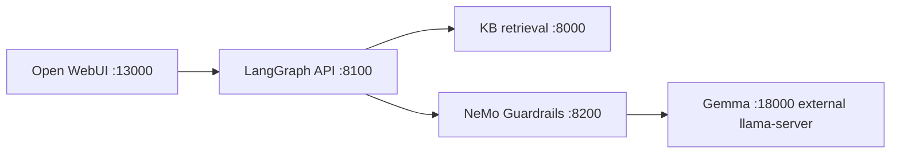

# Work Credit RAG — Phase 1

Umbrella repository for a self-hosted, Persian-capable conversational RAG platform. The implementation is split into independently maintained Git submodules so model/server operations, knowledge-base lifecycle, safety policy, and LangGraph orchestration can evolve without returning to a monolith.

## Repository composition

| Path | Repository | Current responsibility | Default branch |
|---|---|---|---|
| `components/server-setup` | [Work_RAG-Server-Setup](https://github.com/AliNikkhah2001/Work_RAG-Server-Setup) | H200 provisioning, local model and embedding services, Gemma manager, Open WebUI, infrastructure | `main` |
| `components/knowledgebase` | [Work_RAG-KB](https://github.com/AliNikkhah2001/Work_RAG-KB) | KB ingestion, maintenance, versioning, hybrid retrieval, reranking, KB web UI | `master` |
| `components/guardrails` | [Work_RAG-Guardrails](https://github.com/AliNikkhah2001/Work_RAG-Guardrails) | NeMo Guardrails policy service and guarded Gemma gateway | `main` |
| `components/orchestrator` | [Work_RAG-Orchestrator](https://github.com/AliNikkhah2001/Work_RAG-Orchestrator) | LangGraph workflow and public OpenAI-compatible chat API | `main` |

Each gitlink is pinned to an exact commit. Updating a component requires a component-repository commit followed by a parent-repository commit that advances the corresponding gitlink.

## MVP target

The first goal is one small, deterministic, observable request path—not the full production architecture:



Request order:

```text
frontend (Open WebUI :13000)
  -> orchestrator :8100 input-policy check
  -> KB :8000 hybrid retrieval (BM25 + dense + RRF + cross-encoder)
  -> context construction
  -> guardrails :8200 → Gemma :18000 (unsloth/gemma-4-31B-it-GGUF:UD-Q4_K_XL)
  -> citation-shaped response
  -> frontend
```

**Vast deployment:** Gemma is external at `http://127.0.0.1:18000/v1` (host) / `http://host.docker.internal:18000/v1` (Docker). `compose.mvp.yml` removes the legacy gemma-manager service; `LLM_BASE_URL`/`LLM_MODEL` are env-configurable. Public browser URL is `http://91.108.80.253:13000` (`0.0.0.0:13000:8080`). See `docs/RUNBOOK_VAST.md` and `docs/VAST_GEMMA4_MIGRATION.md`.

The MVP deliberately excludes long-term memory, PostgreSQL LangGraph checkpoints, query rewriting, agent loops, retrieval retries, streaming, GraphRAG, multi-agent routing, and Kubernetes. Those come after the basic path is reliable.

The detailed, dependency-ordered plan and acceptance tests are in [docs/MVP_INTEGRATION_PLAN.md](docs/MVP_INTEGRATION_PLAN.md).

## Clone

This repository contains nested submodules: Work RAG KB itself contains a `kb-source` submodule. Clone recursively:

```bash
git clone --recurse-submodules https://github.com/AliNikkhah2001/Work_Credit-RAG_Phase1.git
cd Work_Credit-RAG_Phase1
```

If the repository was already cloned:

```bash
git submodule sync --recursive
git submodule update --init --recursive
```

Inspect the pinned component revisions:

```bash
git submodule status --recursive
```

## Status — Vast `vast-gemma4-migration` (pushed 2026-09-02, pins: guardrails `e59b300`, orchestrator `743b2c7`, KB `3ae7b1e`, server-setup `5d5a7e4`)

Live on Vast VM (2× RTX 6000 Ada, 503 Gi RAM, `91.108.80.253`, Gemma at `http://127.0.0.1:18000/v1`). Full stack verified via host venvs (`8004`/`8200`/`8100`/`13000`); Docker `compose.mvp.yml` is ready for privileged hosts but this Vast host is unprivileged (`unshare` denied) so host fallback is used.

- **Gemma — FIXED at source (was `<unused*>` leak):** `unsloth/gemma-4-31B-it-GGUF:UD-Q4_K_XL` (30.6 B, 18.8 GiB) now on **llama.cpp 0.3.0-dev (build 1, `0f3a71b`, CUDA 12, `2026-09-02` build at `/opt/llama-new/bin/llama-server`)** with `--no-mmproj --jinja --ctx-size 8192 --temp 0.2`. Raw `POST /v1/chat/completions` with `chat_template_kwargs:{"enable_thinking":false}` returns **clean content, no `<unused*>`/`<|tool_call|>`** — verified 5 sequential prompts (`سلام` → `سلام! چطور می‌توانم…`, `Hello`, `اعتبارسنجی چیست`, `چگونه گزارش اعتباری…`, `یک پاسخ کوتاه…`) all `has_unused False` and `reasoning_content` empty. Without the flag, thinking leaks to `reasoning_content` (model behavior, not a bug). Old binary was `b1-ff5ef82` (b8763) with `mmproj` auto-loaded — that combo always injected `<unused*>`. No `gemma-manager` on Vast; Docker reaches Gemma via `host.docker.internal:18000` + `host-gateway`.
- **Open WebUI:** `0.0.0.0:13000:8080` (`ghcr.io/open-webui/open-webui:main`), `OPENAI_API_BASE_URL=http://orchestrator:8100/v1` (Docker) / `http://127.0.0.1:8100/v1` (host); requires Orchestrator `GET /v1/models` (implemented, returns `unsloth/gemma-4-31B-it-GGUF:UD-Q4_K_XL` + alias).
- **KB Manager:** `POST /search/api` (`query`, `top_k`) → `final_results` after BM25 + dense MiniLM 384 + RRF + cross-encoder mmarco; `GET /health`+`/ready` present; bind `0.0.0.0:8000` (Docker) / `127.0.0.1:8004` on Vast host (caddy occupies `*:8000`). DB `kb-manager/data/kb_test.db` 977 MiB, 69 docs, 2399 chunks.
- **Guardrails — FIXED false positives (was HurtLex `حذف`/`بخشی`):** `GET /health`, `GET /ready`, `POST /v1/rails/check`, `POST /v1/chat/completions` (guarded Gemma). Sends `chat_template_kwargs:{"enable_thinking":false}` (commit `3f20bed`) plus **HurtLex allowlist `kb/hurtlex_allowlist.json` (8 lemmas: حذف, بخشی, تامین مالی, اشتغال, پست, مصرف, هدف, نادرست)** to prevent legitimate credit terms from being flagged as `hate` (commit `e59b300`). Before fix, RAG prompt with KB context `درخواست حذف سابقه منفی قدیمی` was blocked at input as `hate:حذف` before Gemma, so `چگونه می‌توانم گزارش اعتباری...` returned `content_filter` with 0 citations. After fix, 6/6 credit queries (`چگونه می‌توانم گزارش...`, `اعتبارسنجی چیست`, `امتیاز اعتباری...`, `درخواست حذف...`, `بخشی از اطلاعات...`, `تامین مالی...`) all return `stop` with 5 citations, no `<unused>`, and genuine hate/profanity/PII/secret still blocked (18 new regression tests).
- **Orchestrator:** LangGraph `validate_input → retrieve → build_context → guarded_generate → format_response`; `GET /health`, `GET /ready` (deps), `GET /v1/models`, `POST /v1/chat/completions` (public OpenAI-compatible + `rag.citations`). Keeps `_clean_answer` as defensive only. When genuinely blocked, returns `content_filter` with 0 citations (retrieval preserved internally for diagnostics); for allowlisted benign, citations preserved.

Integrated stack is `compose.mvp.yml` (no `gemma-manager`, only `0.0.0.0:13000` public, others `expose` internal, `host.docker.internal:host-gateway` for Gemma). Host fallback uses venvs on `8004`/`8200`/`8100`/`13000`. See `docs/RUNBOOK_VAST.md` (startup, health, public URL `http://91.108.80.253:13000` or `8080→22341`, env) and `docs/VAST_GEMMA4_MIGRATION.md` §11–16 (root cause + source fix + HurtLex allowlist verification).

## Ownership rule

Code belongs in the repository that owns its concern:

- hardware, model lifecycle, container infrastructure, and frontend wiring -> Server Setup;
- source documents, ingestion, indexing, retrieval, reranking, and KB evaluation -> Knowledgebase;
- Colang/policy configuration and guarded model access -> Guardrails;
- graph state, node order, dependency adapters, and the public chat API -> Orchestrator;
- cross-repository contracts, pinned revisions, integrated startup, and end-to-end acceptance -> this parent repository.

Do not duplicate component implementation in the parent repository.

## Updating a submodule

```bash
cd components/orchestrator
git switch main
git pull --ff-only
cd ../..
git add components/orchestrator
git commit -m "chore: advance orchestrator submodule"
```

Always run the contract and end-to-end tests before advancing a production pin.

## License

See [LICENSE](LICENSE). Each submodule may also declare its own license and dependency obligations.
