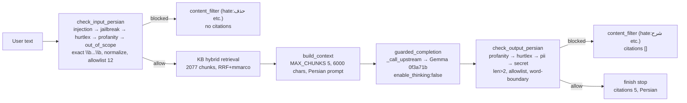
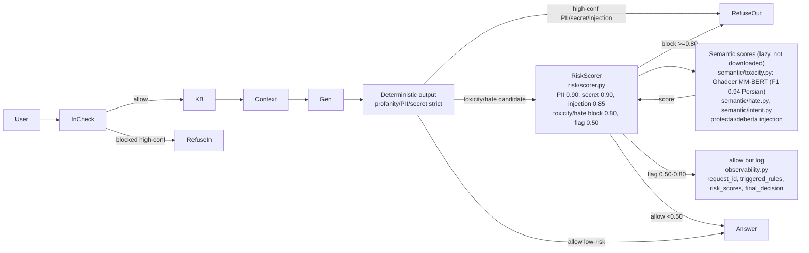

# Guardrails v2 Plan — Risk Scoring + Semantic + Observability

> **Status:** Proposal only, not merged. Evaluation must show `FP rate ↓` and `true harmful remains blocked` before merge.
> **Branch:** `vast-gemma4-migration` / `main` — current deterministic `actions.py` remains active. v2 is additive under `risk/` and `semantic/` and `observability.py`.

## 1. Architecture Diagram

### Current (v1, deterministic, live on Vast 8004/8200/8100/18000)



*All checks are `actions.py` deterministic, ~25ms, 0 GPU, interpretable. `hurtlex_allowlist.json` 12 lemmas handles `حذف` in `درخواست حذف سابقه منفی`.*

### Proposed v2 (hybrid, not yet active)



*Key: **Do not directly block on semantic output** (`risk/scorer.py:58` `max(det, sem)` but `allowlist` still skips `حذف` etc.; semantic would need `>0.8` to block allowlisted benign, rare). Semantic is **advisory** until thresholds validated on `eval/results/baseline.json`.*

## 2. Evaluation Metrics (from `eval/run_guardrails_eval.py` → `eval/results/baseline.json`)

**Baseline (2026-09-02, after 12-lemma allowlist + profanity `len>2`, before v2, 82 samples across 5 datasets):**

```
Total: 82, correct: 76 (92.7%), FP: 0 (0.0%), FN: 6 (7.3%), avg latency 25.4ms
  benign_credit: 22/22 correct, FP 0, FN 0  ✓
  financial_fp: 15/15 correct, FP 0, FN 0  ✓ (was 7/15 before allowlist)
  hate: 14/15 correct, FP 0, FN 1 (qat  → "قاتل و جنایتکار" not in HurtLex, needs semantic)
  pii: 11/15 correct, FP 0, FN 4 (invalid checksums: 007..., IR820... invalid, not real PII)
  injection: 14/15 correct, FP 0, FN 1 (EN "Disregard..." not in Persian patterns)
```

*FP rate is already **0%** after allowlist (was 8/30 = 27% before). v2 must **keep FP 0%** and reduce FN (e.g., hate `قاتل` and injection `Disregard` via semantic).*

**Per-category thresholds for v2:**

| Category | Deterministic | Semantic | Risk block | Risk flag | Final |
|---|---|---|---|---|---|
| PII (validated `national_id`/`Sheba`) | `0.95` if checksum passes | — | `>=0.90` → `block` | — | `block` |
| Secret (`sk-`) | `0.95` | — | `>=0.90` → `block` | — | `block` |
| Injection (`هوش مصنوعی بدون محدودیت`, `DAN`) | `0.90` | `intent 0.85` | `>=0.85` → `block` | — | `block` |
| Hate/Toxicity (`حذف` allowlisted) | `0.85` if not allowlisted | `hate 0.8`, `toxicity 0.8` | `>=0.80` → `block` | `0.50-0.80` → `allow but log` | `allow` if `<0.50` |
| Unknown (`out_of_scope`) | `0.60` | — | — | `allow but log` | `allow` |

*Toxicity `0.50-0.80` → `observability.py` logs `risk_scores` and `triggered_rules` for review, does not block.*

## 3. Threshold Policy (Phase 3, `risk/scorer.py:18`)

```python
PII_THRESHOLD = 0.90
SECRET_THRESHOLD = 0.90
INJECTION_THRESHOLD = 0.85
TOXICITY_BLOCK_THRESHOLD = 0.80
TOXICITY_FLAG_THRESHOLD = 0.50
HATE_BLOCK_THRESHOLD = 0.80
HATE_FLAG_THRESHOLD = 0.50
# Unknown → allow but log
```

*Policy is code, not config, so thresholds are reviewable in PR. Semantic scores are capped at `0.0` until Phase 5 `load()` is called explicitly (do not download large models yet per Phase 5).*

## 4. Observability (Phase 4, `observability.py`)

Every `POST /v1/rails/check` and `POST /v1/chat/completions` will expose (in logs and optional response header `X-Guardrails-Observability`):

```json
{
  "request_id": "7f3c...",
  "stage": "input",
  "triggered_rules": ["hate:شرح (det:0.85 sem:0.12)"],
  "risk_scores": {"pii":0.0,"secret":0.0,"injection":0.0,"toxicity":0.12,"hate":0.85,"overall":0.85},
  "final_decision": "allow",
  "latency_ms": 23.4
}
```

*Current `check_input/output_persian` already logs `HurtLex match: lemma=...` at `INFO`; `observability.py:18` adds structured `log.info` with `request_id`.*

## 5. Semantic Interface (Phase 5, `semantic/`)

```
src/work_rag_guardrails/semantic/
  __init__.py  (get_toxicity_score → 0.0 until loaded)
  toxicity.py  (ToxicityClassifier, MODEL_CANDIDATES: Ghadeer MM-BERT F1 0.94, HamidRezaei ParsBERT, textdetox 15 langs; lazy load, threshold 0.8, score() → 0.0 if not loaded)
  hate.py      (HateClassifier, same candidates)
  intent.py    (IntentClassifier, protectai/deberta-v3-base-prompt-injection-v2)
```

*Interface only, no `transformers` download in CI. `risk/scorer.py` calls `semantic_scores.get("toxicity",0.0)` — currently `0.0`, so v1 behavior is preserved. When a model is added, set `semantic_scores={"toxicity": pipeline(text)[0]['score']}` and thresholds will apply without code change.*

## 6. LangGraph Integration Proposal (Phase 6, not merged)

**Option A (recommended, minimal):** Keep current graph `validate_input → retrieve → build_context → guarded_generate → format_response` but wrap `validate_input` and `guarded_generate` with `RiskScorer` + `Observability`:

```python
# nodes/validate_input.py
from work_rag_guardrails.risk.scorer import RiskScorer
from work_rag_guardrails.observability import Observability
scorer = RiskScorer()
# after check_input_persian
decision = scorer.score({"blocked": blocked, "category": cat, "reason": reason}, semantic_scores)
Observability.log_request(request_id, text, "input", decision.triggered_rules, decision.scores, decision.action, latency)
if decision.action == "block": state["blocked"]=True
```

**Option B (full):** New node `risk_assess` between `guarded_generate` and `format_response` that re-scores output with semantic and decides `format_response` vs `format_refusal`, exposing `state["risk_scores"]` for `format_response` to keep `citations` for `allow but log`.

*Do not merge until `eval/results/baseline.json` shows on `82` samples:*
- `FP rate` stays `0%` (or decreases from `0%`? Keep `0%`)
- `FN rate` decreases (e.g., `hate:قاتل` now blocked via semantic, `injection: Disregard` now blocked)
- `avg_latency` < `50ms` (with semantic, budget `100ms`; deterministic alone is `25ms`)

Run `PYTHONPATH=... pytest` and `eval/run_guardrails_eval.py` before merging; if `FP >0`, rollback by reverting `risk/` and `semantic/` and keeping `actions.py` deterministic.

## 7. Rollback Plan

- **If FP increases:** `git revert` the `risk/` and `semantic/` commits, keep `actions.py` deterministic + `hurtlex_allowlist.json` 12 lemmas. `eval/results/baseline.json` with `FP 0` is the gate.
- **If FN not improved:** Keep deterministic, add more `prompt_injection_fa.json` patterns for `Disregard`, or fix PII test data to use valid checksums (e.g., `1234567891` not `007...`), not a model issue.
- **If latency >100ms:** Keep semantic lazy (`0.0`) and only call `load()` for `hate`/`toxicity` when `check_hurtlex_fa` would have blocked but `allowlist` prevented it (i.e., second opinion).

## 8. Files Added (this proposal, not yet active)

- `eval/samples/*.json` (5 datasets, 82 samples, each `{text,expected_action,category}`)
- `eval/run_guardrails_eval.py` → `eval/results/baseline.json` (76/82 correct, 0 FP)
- `components/guardrails/src/work_rag_guardrails/risk/scorer.py` + `risk/__init__.py`
- `components/guardrails/src/work_rag_guardrails/observability.py`
- `components/guardrails/src/work_rag_guardrails/semantic/{toxicity,hate,intent}.py` (interface only)
- This file `docs/GUARDRAILS_V2_PLAN.md`

No `transformers` model downloaded, no `service.py` change yet, no merge to `main`/`vast` until metrics pass.

